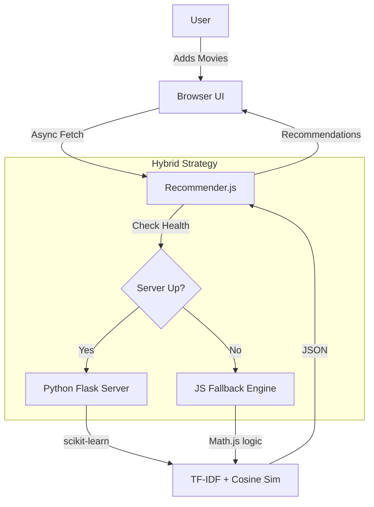

# Movie Library App — Complete OOP Guide

## Build It. Understand It. Master OOP.

This guide teaches you **Object-Oriented Programming (OOP) in JavaScript** by building a fully working Movie Library app. Every line of code is explained for absolute beginners.

This guide is split into two halves:
- **Part 1 (Sections 1-8):** Complete, working code. Copy each file and run it.
- **Part 2 (Sections 9-16):** Deep-dive explanations of every OOP concept, method, and property used.

**What you'll build:**
- 🎬 **Movie search** powered by the OMDB API (real movie data!)
- 📚 **Personal collection** — add, remove, and browse your movies
- ⭐ **Review system** with star ratings
- 🎭 **Genre-themed cards** — Action (red), Comedy (yellow), Drama (blue), Horror (purple)
- 🔐 **User accounts** with private fields (OOP encapsulation)
- 🏗️ **Full OOP architecture** — Classes, Inheritance, Polymorphism, Encapsulation

---

---

## Table of Contents

### Part 1: The Code (Build It)
1. [Project Setup & Folder Structure](#1-project-setup--folder-structure)
2. [Complete index.html](#2-complete-indexhtml)
3. [Complete css/style.css](#3-complete-cssstylecss)
4. [Complete js/Movie.js](#4-complete-jsmoviejs)
5. [Complete js/User.js](#5-complete-jsuserjs)
6. [Complete js/Review.js](#6-complete-jsreviewjs)
7. [Complete js/api.js](#7-complete-jsapijs)
8. [Complete js/app.js](#8-complete-jsappjs)

### Part 2: The Knowledge (Master It)
9. [What is OOP? — The Big Picture](#9-what-is-oop--the-big-picture)
10. [The Four Pillars of OOP](#10-the-four-pillars-of-oop)
11. [Classes & Constructors — Blueprints for Objects](#11-classes--constructors--blueprints-for-objects)
12. [Inheritance — extends & super](#12-inheritance--extends--super)
13. [Private Fields — The # Symbol](#13-private-fields--the--symbol)
14. [Polymorphism — Same Method, Different Behavior](#14-polymorphism--same-method-different-behavior)
15. [Getters, Setters & Static Methods](#15-getters-setters--static-methods)
16. [API Integration Deep-Dive — OMDB & fetch()](#16-api-integration-deep-dive--omdb--fetch)
17. [Every Function Explained](#17-every-function-explained)
18. [How All the Classes & Functions Connect](#18-how-all-the-classes--functions-connect)

### Part 3: Extras
19. [Common OOP Mistakes & Gotchas](#19-common-oop-mistakes--gotchas)
20. [Creativity & Next Steps](#20-creativity--next-steps)

### Part 4: Creative Enhancements (16 New Features)
21. [Feature 1: Light/Dark Theme Toggle](#21-feature-1-lightdark-theme-toggle)
22. [Feature 2: Sort Collection](#22-feature-2-sort-collection)
23. [Feature 3: Random Pick](#23-feature-3-random-pick)
24. [Feature 4: Toast Notifications](#24-feature-4-toast-notifications)
25. [Feature 5: Stats Dashboard](#25-feature-5-stats-dashboard)
26. [Feature 6: Watchlist (Want to Watch)](#26-feature-6-watchlist-want-to-watch)
27. [Feature 7: Custom Tags](#27-feature-7-custom-tags)
28. [Feature 8: Movie Sharing](#28-feature-8-movie-sharing)
29. [Feature 9: Advanced Search](#29-feature-9-advanced-search)
30. [Feature 10: Achievement/Badge System](#30-feature-10-achievementbadge-system)
31. [Feature 11: Mood Tracker](#31-feature-11-mood-tracker)
32. [Feature 12: Watch History Timeline](#32-feature-12-watch-history-timeline)
33. [Feature 13: Smart Recommendations](#33-feature-13-smart-recommendations)
34. [Feature 14: Movie Quiz Game](#34-feature-14-movie-quiz-game)
35. [Feature 15: EventEmitter (Observer Pattern)](#35-feature-15-eventemitter-observer-pattern)
36. [Feature 16: Import/Export Collection](#36-feature-16-importexport-collection)
37. [New Files & Folder Structure](#37-new-files--folder-structure)
38. [OOP Concepts Applied Across All Features](#38-oop-concepts-applied-across-all-features)

### Part 5: Auth & Intelligence Upgrades
39. [Feature 17: Forgot Password (Security Question)](#39-feature-17-forgot-password-security-question)
40. [Feature 18: Remember Me (Auto-Login)](#40-feature-18-remember-me-auto-login)
41. [Feature 19: Where to Watch (Streaming Links)](#41-feature-19-where-to-watch-streaming-links)
42. [Feature 20: ML Recommender System (Cosine Similarity)](#42-feature-20-ml-recommender-system-cosine-similarity)
43. [Feature 21: Robust Authentication (Capitalization Fix)](#43-feature-21-robust-authentication-capitalization-fix)
44. [Feature 22: Show/Hide Password Toggle](#44-feature-22-showhide-password-toggle)
45. [SEO & Discoverability Enhancements](#45-seo--discoverability-enhancements)

---

# PART 1: THE CODE (Build It)

> Copy each file below into your project. When all files are in place, open `index.html` in your browser — it works immediately (you'll need an OMDB API key for search — see Section 7).

---

## 1. Project Setup & Folder Structure

Create these folders and files:

```
movie-library/
├── index.html
├── css/
│   └── style.css
└── js/
    ├── Movie.js       ← Movie class + ActionMovie, ComedyMovie, etc.
    ├── User.js        ← User class with private fields
    ├── Review.js      ← Review class with private rating
    ├── api.js         ← OMDB API integration
    └── app.js         ← Main application logic (ties everything together)
```

---

## 2. Complete index.html

Create `index.html` in the root of your project folder:

```html
<!DOCTYPE html>
<html lang="en">
<head>
    <meta charset="UTF-8">
    <meta name="viewport" content="width=device-width, initial-scale=1.0">
    <title>Movie Library</title>
    <link rel="stylesheet" href="./css/style.css">
    <link href="https://fonts.googleapis.com/css2?family=Inter:wght@400;500;600;700;800&display=swap" rel="stylesheet">
</head>
<body>
    <div class="app" id="app">

        <!-- ========== SCREEN 1: LOGIN / SIGNUP ========== -->
        <section id="auth-screen" class="screen">
            <div class="auth-container">
                <h1 class="auth-title">🎬 Movie Library</h1>
                <p class="auth-subtitle">Your personal movie collection</p>

                <div class="auth-tabs">
                    <button class="auth-tab active" id="login-tab">Login</button>
                    <button class="auth-tab" id="signup-tab">Sign Up</button>
                </div>

                <!-- Login Form -->
                <form id="login-form" class="auth-form">
                    <div class="form-group">
                        <label for="login-email">Email</label>
                        <input type="email" id="login-email" required>
                    </div>
                    <div class="form-group">
                        <label for="login-password">Password</label>
                        <div class="password-field">
                            <input type="password" id="login-password" required minlength="6">
                            <button type="button" class="password-toggle" id="login-password-toggle"
                                aria-label="Show password">Show</button>
                        </div>
                    </div>
                    <button type="submit" class="btn btn-primary">Login</button>
                    <p class="error-message" id="login-error"></p>
                </form>

                <!-- Signup Form -->
                <form id="signup-form" class="auth-form hidden">
                    <div class="form-group">
                        <label for="signup-name">Name</label>
                        <input type="text" id="signup-name" required minlength="2">
                    </div>
                    <div class="form-group">
                        <label for="signup-email">Email</label>
                        <input type="email" id="signup-email" required>
                    </div>
                    <div class="form-group">
                        <label for="signup-password">Password</label>
                        <input type="password" id="signup-password" required minlength="6">
                    </div>
                    <button type="submit" class="btn btn-primary">Create Account</button>
                    <p class="error-message" id="signup-error"></p>
                </form>
            </div>
        </section>

        <!-- ========== SCREEN 2: DASHBOARD ========== -->
        <section id="dashboard-screen" class="screen hidden">
            <header class="dashboard-header">
                <div class="header-left">
                    <h1 class="logo">🎬 Movie Library</h1>
                    <span class="user-greeting" id="user-greeting">Welcome, User</span>
                </div>
                <div class="header-right">
                    <div class="user-stats" id="user-stats"></div>
                    <button class="btn btn-small btn-danger" id="logout-btn">Logout</button>
                </div>
            </header>

            <!-- Search Bar -->
            <div class="search-container">
                <input type="text" id="search-input" class="search-input" placeholder="Search movies by title...">
                <button class="btn btn-primary" id="search-btn">🔍 Search</button>
            </div>

            <!-- Search Results -->
            <div id="search-results" class="search-results hidden">
                <div class="section-header">
                    <h2>Search Results</h2>
                    <button class="btn btn-small btn-secondary" id="close-search-btn">✕ Close</button>
                </div>
                <div id="search-results-grid" class="movie-grid"></div>
                <p id="search-message" class="info-message"></p>
            </div>

            <!-- Genre Filter -->
            <div class="filter-bar">
                <button class="filter-btn active" data-filter="all">All</button>
                <button class="filter-btn" data-filter="Action">🔥 Action</button>
                <button class="filter-btn" data-filter="Comedy">😂 Comedy</button>
                <button class="filter-btn" data-filter="Drama">🎭 Drama</button>
                <button class="filter-btn" data-filter="Horror">👻 Horror</button>
                <button class="filter-btn" data-filter="Other">📽️ Other</button>
            </div>

            <!-- My Collection -->
            <div class="collection-container">
                <h2 class="section-title">My Collection <span id="collection-count">(0 movies)</span></h2>
                <div id="collection-grid" class="movie-grid"></div>
                <p id="empty-collection" class="info-message">Your collection is empty. Search for movies to add!</p>
            </div>
        </section>

        <!-- ========== MODAL: MOVIE DETAIL ========== -->
        <div id="movie-modal" class="modal hidden">
            <div class="modal-overlay" id="modal-overlay"></div>
            <div class="modal-content">
                <button class="modal-close" id="modal-close-btn">✕</button>
                <div id="modal-body"></div>
            </div>
        </div>

    </div>

    <!-- Script loading order matters: classes first, then app -->
    <script src="./js/Review.js"></script>
    <script src="./js/Movie.js"></script>
    <script src="./js/User.js"></script>
    <script src="./js/api.js"></script>
    <script src="./js/app.js"></script>
</body>
</html>
```

---

## 3. Complete css/style.css

Create `css/style.css`:

```css
/* ===== RESET & VARIABLES ===== */
*,
*::before,
*::after {
    box-sizing: border-box;
    margin: 0;
    padding: 0;
}

:root {
    --primary: #8b5cf6;
    --primary-dark: #7c3aed;
    --secondary: #64748b;
    --success: #22c55e;
    --danger: #ef4444;
    --warning: #f59e0b;
    --bg-main: #0a0a1a;
    --bg-card: #1a1a2e;
    --bg-input: #16213e;
    --bg-hover: #0f3460;
    --text-primary: #e2e8f0;
    --text-secondary: #94a3b8;
    --border-color: #334155;
    --action-color: #ef4444;
    --comedy-color: #eab308;
    --drama-color: #3b82f6;
    --horror-color: #a855f7;
    --other-color: #64748b;
    --spacing-xs: 0.5rem;
    --spacing-sm: 1rem;
    --spacing-md: 1.5rem;
    --spacing-lg: 2rem;
    --spacing-xl: 3rem;
    --radius-sm: 0.5rem;
    --radius-md: 1rem;
    --radius-lg: 1.5rem;
    --radius-full: 9999px;
    --shadow-sm: 0 1px 3px rgba(0, 0, 0, 0.4);
    --shadow-md: 0 4px 12px rgba(0, 0, 0, 0.4);
    --shadow-lg: 0 10px 30px rgba(0, 0, 0, 0.5);
}

body {
    font-family: 'Inter', -apple-system, BlinkMacSystemFont, sans-serif;
    background: var(--bg-main);
    color: var(--text-primary);
    min-height: 100vh;
    line-height: 1.6;
}

/* ===== LAYOUT ===== */
.app {
    max-width: 1100px;
    margin: 0 auto;
    padding: var(--spacing-md);
}

.screen {
    animation: fadeIn 0.3s ease;
}

.screen.hidden, .hidden {
    display: none;
}

@keyframes fadeIn {
    from { opacity: 0; transform: translateY(15px); }
    to { opacity: 1; transform: translateY(0); }
}

/* ===== BUTTONS ===== */
.btn {
    padding: var(--spacing-sm) var(--spacing-md);
    border: none;
    border-radius: var(--radius-sm);
    font-size: 1rem;
    font-weight: 600;
    cursor: pointer;
    transition: all 0.2s ease;
    font-family: inherit;
}

.btn:hover {
    transform: translateY(-2px);
    box-shadow: var(--shadow-md);
}

.btn:active { transform: translateY(0); }

.btn-primary {
    background: var(--primary);
    color: white;
}
.btn-primary:hover { background: var(--primary-dark); }

.btn-secondary {
    background: var(--bg-input);
    color: var(--text-primary);
}

.btn-success { background: var(--success); color: white; }
.btn-danger { background: var(--danger); color: white; }

.btn-small {
    padding: var(--spacing-xs) var(--spacing-sm);
    font-size: 0.85rem;
}

/* ===== AUTH SCREEN ===== */
.auth-container {
    max-width: 420px;
    margin: 10vh auto;
    padding: var(--spacing-lg);
    background: var(--bg-card);
    border-radius: var(--radius-lg);
    box-shadow: var(--shadow-lg);
}

.auth-title {
    text-align: center;
    font-size: 2.2rem;
    margin-bottom: var(--spacing-xs);
    background: linear-gradient(135deg, var(--primary), var(--comedy-color));
    -webkit-background-clip: text;
    -webkit-text-fill-color: transparent;
    background-clip: text;
}

.auth-subtitle {
    text-align: center;
    color: var(--text-secondary);
    margin-bottom: var(--spacing-lg);
}

.auth-tabs {
    display: flex;
    gap: var(--spacing-xs);
    margin-bottom: var(--spacing-lg);
}

.auth-tab {
    flex: 1;
    padding: var(--spacing-sm);
    background: var(--bg-input);
    border: 2px solid transparent;
    border-radius: var(--radius-sm);
    color: var(--text-secondary);
    cursor: pointer;
    font-size: 1rem;
    font-weight: 600;
    transition: all 0.2s ease;
    font-family: inherit;
}

.auth-tab.active {
    border-color: var(--primary);
    color: var(--primary);
    background: rgba(139, 92, 246, 0.1);
}

.form-group {
    margin-bottom: var(--spacing-md);
}

.form-group label {
    display: block;
    margin-bottom: var(--spacing-xs);
    color: var(--text-secondary);
    font-size: 0.875rem;
}

.form-group input, .form-group textarea {
    width: 100%;
    padding: var(--spacing-sm);
    background: var(--bg-input);
    border: 2px solid transparent;
    border-radius: var(--radius-sm);
    color: var(--text-primary);
    font-size: 1rem;
    transition: border-color 0.2s ease;
    font-family: inherit;
}

.form-group input:focus, .form-group textarea:focus {
    outline: none;
    border-color: var(--primary);
}

.error-message {
    color: var(--danger);
    font-size: 0.875rem;
    margin-top: var(--spacing-sm);
    min-height: 1.25rem;
}

.auth-form .btn { width: 100%; }

/* ===== DASHBOARD HEADER ===== */
.dashboard-header {
    display: flex;
    justify-content: space-between;
    align-items: center;
    margin-bottom: var(--spacing-lg);
    flex-wrap: wrap;
    gap: var(--spacing-sm);
}

.header-left { display: flex; align-items: center; gap: var(--spacing-md); }
.header-right { display: flex; align-items: center; gap: var(--spacing-sm); }

.logo {
    font-size: 1.5rem;
    background: linear-gradient(135deg, var(--primary), var(--comedy-color));
    -webkit-background-clip: text;
    -webkit-text-fill-color: transparent;
    background-clip: text;
}

.user-greeting {
    color: var(--text-secondary);
    font-size: 0.9rem;
}

.user-stats {
    display: flex;
    gap: var(--spacing-sm);
    font-size: 0.85rem;
    color: var(--text-secondary);
}

.stat-item {
    background: var(--bg-card);
    padding: 4px 12px;
    border-radius: var(--radius-full);
}

/* ===== SEARCH ===== */
.search-container {
    display: flex;
    gap: var(--spacing-sm);
    margin-bottom: var(--spacing-lg);
}

.search-input {
    flex: 1;
    padding: var(--spacing-sm) var(--spacing-md);
    background: var(--bg-card);
    border: 2px solid var(--border-color);
    border-radius: var(--radius-sm);
    color: var(--text-primary);
    font-size: 1rem;
    transition: border-color 0.2s ease;
    font-family: inherit;
}

.search-input:focus {
    outline: none;
    border-color: var(--primary);
}

.search-results {
    margin-bottom: var(--spacing-lg);
    padding: var(--spacing-md);
    background: var(--bg-card);
    border-radius: var(--radius-md);
}

.section-header {
    display: flex;
    justify-content: space-between;
    align-items: center;
    margin-bottom: var(--spacing-md);
}

.info-message {
    text-align: center;
    color: var(--text-secondary);
    padding: var(--spacing-lg);
    font-style: italic;
}

/* ===== FILTER BAR ===== */
.filter-bar {
    display: flex;
    gap: var(--spacing-xs);
    margin-bottom: var(--spacing-lg);
    flex-wrap: wrap;
}

.filter-btn {
    padding: 8px 16px;
    background: var(--bg-card);
    border: 2px solid transparent;
    border-radius: var(--radius-full);
    color: var(--text-secondary);
    cursor: pointer;
    font-size: 0.85rem;
    font-weight: 600;
    transition: all 0.2s ease;
    font-family: inherit;
}

.filter-btn:hover { border-color: var(--border-color); }

.filter-btn.active {
    border-color: var(--primary);
    color: var(--primary);
    background: rgba(139, 92, 246, 0.1);
}

/* ===== MOVIE GRID ===== */
.movie-grid {
    display: grid;
    grid-template-columns: repeat(auto-fill, minmax(200px, 1fr));
    gap: var(--spacing-md);
}

.section-title {
    margin-bottom: var(--spacing-md);
    font-size: 1.3rem;
}

.section-title span {
    color: var(--text-secondary);
    font-weight: 400;
    font-size: 0.9rem;
}

/* ===== MOVIE CARDS (Base + Genre Variants) ===== */
.movie-card {
    background: var(--bg-card);
    border-radius: var(--radius-md);
    overflow: hidden;
    transition: all 0.3s ease;
    cursor: pointer;
    border: 2px solid transparent;
    position: relative;
}

.movie-card:hover {
    transform: translateY(-6px);
    box-shadow: var(--shadow-lg);
}

/* Genre-specific card borders on hover */
.movie-card.action-card:hover { border-color: var(--action-color); box-shadow: 0 8px 25px rgba(239, 68, 68, 0.2); }
.movie-card.comedy-card:hover { border-color: var(--comedy-color); box-shadow: 0 8px 25px rgba(234, 179, 8, 0.2); }
.movie-card.drama-card:hover { border-color: var(--drama-color); box-shadow: 0 8px 25px rgba(59, 130, 246, 0.2); }
.movie-card.horror-card:hover { border-color: var(--horror-color); box-shadow: 0 8px 25px rgba(168, 85, 247, 0.2); }
.movie-card.other-card:hover { border-color: var(--other-color); box-shadow: 0 8px 25px rgba(100, 116, 139, 0.2); }

/* Genre badge */
.genre-badge {
    position: absolute;
    top: 8px;
    right: 8px;
    padding: 3px 10px;
    border-radius: var(--radius-full);
    font-size: 0.7rem;
    font-weight: 700;
    text-transform: uppercase;
    letter-spacing: 0.5px;
    color: white;
}

.genre-badge.action { background: var(--action-color); }
.genre-badge.comedy { background: var(--comedy-color); color: #1a1a2e; }
.genre-badge.drama { background: var(--drama-color); }
.genre-badge.horror { background: var(--horror-color); }
.genre-badge.other { background: var(--other-color); }

.movie-poster {
    width: 100%;
    height: 280px;
    object-fit: cover;
    background: var(--bg-input);
}

.movie-poster-placeholder {
    width: 100%;
    height: 280px;
    background: var(--bg-input);
    display: flex;
    align-items: center;
    justify-content: center;
    font-size: 3rem;
    color: var(--text-secondary);
}

.movie-info {
    padding: var(--spacing-sm);
}

.movie-title {
    font-size: 0.95rem;
    font-weight: 700;
    margin-bottom: 4px;
    white-space: nowrap;
    overflow: hidden;
    text-overflow: ellipsis;
}

.movie-year {
    font-size: 0.8rem;
    color: var(--text-secondary);
    margin-bottom: 6px;
}

.movie-rating {
    font-size: 0.85rem;
    color: var(--comedy-color);
    letter-spacing: 1px;
}

.movie-card-actions {
    padding: 0 var(--spacing-sm) var(--spacing-sm);
    display: flex;
    gap: var(--spacing-xs);
}

.movie-card-actions .btn {
    flex: 1;
    font-size: 0.8rem;
    padding: 6px;
}

/* ===== MODAL ===== */
.modal {
    position: fixed;
    top: 0;
    left: 0;
    width: 100%;
    height: 100%;
    z-index: 1000;
    display: flex;
    align-items: center;
    justify-content: center;
}

.modal.hidden { display: none; }

.modal-overlay {
    position: absolute;
    top: 0;
    left: 0;
    width: 100%;
    height: 100%;
    background: rgba(0, 0, 0, 0.7);
    backdrop-filter: blur(4px);
}

.modal-content {
    position: relative;
    background: var(--bg-card);
    border-radius: var(--radius-lg);
    padding: var(--spacing-lg);
    max-width: 700px;
    width: 90%;
    max-height: 85vh;
    overflow-y: auto;
    box-shadow: var(--shadow-lg);
    animation: modalSlideIn 0.3s ease;
}

@keyframes modalSlideIn {
    from { opacity: 0; transform: scale(0.95) translateY(20px); }
    to { opacity: 1; transform: scale(1) translateY(0); }
}

.modal-close {
    position: absolute;
    top: 12px;
    right: 16px;
    background: none;
    border: none;
    color: var(--text-secondary);
    font-size: 1.5rem;
    cursor: pointer;
    padding: 4px;
    transition: color 0.2s;
}

.modal-close:hover { color: var(--text-primary); }

/* ===== MOVIE DETAIL (inside modal) ===== */
.movie-detail {
    display: grid;
    grid-template-columns: 200px 1fr;
    gap: var(--spacing-lg);
}

.movie-detail-poster {
    width: 100%;
    border-radius: var(--radius-sm);
}

.movie-detail-info h2 {
    font-size: 1.5rem;
    margin-bottom: var(--spacing-xs);
}

.movie-detail-meta {
    color: var(--text-secondary);
    font-size: 0.9rem;
    margin-bottom: var(--spacing-sm);
}

.movie-detail-meta span {
    margin-right: var(--spacing-sm);
}

.movie-detail-plot {
    margin-bottom: var(--spacing-md);
    line-height: 1.7;
    color: var(--text-secondary);
}

.movie-detail-crew {
    font-size: 0.9rem;
    color: var(--text-secondary);
    margin-bottom: var(--spacing-md);
}

.movie-detail-crew strong {
    color: var(--text-primary);
}

/* ===== REVIEWS ===== */
.reviews-section {
    margin-top: var(--spacing-lg);
    border-top: 1px solid var(--border-color);
    padding-top: var(--spacing-lg);
}

.reviews-section h3 {
    margin-bottom: var(--spacing-md);
}

.review-form {
    background: var(--bg-input);
    padding: var(--spacing-md);
    border-radius: var(--radius-md);
    margin-bottom: var(--spacing-md);
}

.star-input {
    display: flex;
    gap: 4px;
    margin-bottom: var(--spacing-sm);
}

.star-input span {
    font-size: 1.8rem;
    cursor: pointer;
    color: var(--border-color);
    transition: color 0.15s;
}

.star-input span.active {
    color: var(--comedy-color);
}

.review-item {
    background: var(--bg-input);
    padding: var(--spacing-sm);
    border-radius: var(--radius-sm);
    margin-bottom: var(--spacing-sm);
    border-left: 3px solid var(--primary);
}

.review-header {
    display: flex;
    justify-content: space-between;
    margin-bottom: var(--spacing-xs);
}

.review-author {
    font-weight: 600;
    font-size: 0.9rem;
}

.review-stars {
    color: var(--comedy-color);
    letter-spacing: 1px;
}

.review-text {
    color: var(--text-secondary);
    font-size: 0.9rem;
}

.review-date {
    color: var(--text-secondary);
    font-size: 0.75rem;
    margin-top: var(--spacing-xs);
}

/* ===== RESPONSIVE ===== */
@media (max-width: 700px) {
    .movie-grid { grid-template-columns: repeat(auto-fill, minmax(150px, 1fr)); }
    .movie-detail { grid-template-columns: 1fr; }
    .dashboard-header { flex-direction: column; align-items: flex-start; }
    .search-container { flex-direction: column; }
    .movie-poster, .movie-poster-placeholder { height: 220px; }
}
```

---

## 4. Complete js/Movie.js

Create `js/Movie.js` — this file contains the **base Movie class** and four genre subclasses that **inherit** from it:

```javascript
// ===== MOVIE CLASS (Base Class) =====
// This is the "blueprint" for every movie in the library.
// All genre-specific movie types (ActionMovie, ComedyMovie, etc.) inherit from this.

class Movie {
    // Private field — cannot be accessed from outside the class
    #userRating;

    constructor(title, year, genre, poster, imdbID, plot, director, actors) {
        this.title = title;
        this.year = year;
        this.genre = genre;
        this.poster = poster;          // URL to the poster image
        this.imdbID = imdbID;          // Unique identifier from IMDB
        this.plot = plot;
        this.director = director;
        this.actors = actors;
        this.#userRating = 0;          // Private: only accessible via getter/setter
        this.reviews = [];             // Array of Review objects
        this.dateAdded = new Date().toISOString();
    }

    // Getter — read the private rating
    get rating() {
        return this.#userRating;
    }

    // Setter — set the rating with validation
    set rating(value) {
        if (value < 0 || value > 5) {
            throw new Error('Rating must be between 0 and 5');
        }
        this.#userRating = Math.round(value);
    }

    // Add a review to this movie
    addReview(review) {
        this.reviews.push(review);
        // Update the average rating
        this.#userRating = Math.round(this.getAverageRating());
    }

    // Calculate average rating from all reviews
    getAverageRating() {
        if (this.reviews.length === 0) return 0;
        const sum = this.reviews.reduce((acc, r) => acc + r.rating, 0);
        return parseFloat((sum / this.reviews.length).toFixed(1));
    }

    // Get star display string (★★★☆☆)
    getStars() {
        const filled = this.#userRating;
        return '★'.repeat(filled) + '☆'.repeat(5 - filled);
    }

    // Get the CSS class for this genre (used for styling)
    getGenreClass() {
        return 'other-card';
    }

    // Get the genre badge class
    getBadgeClass() {
        return 'other';
    }

    // Get the genre emoji
    getEmoji() {
        return '📽️';
    }

    // DISPLAY — creates the HTML card for the collection grid
    // This is the DEFAULT display. Subclasses OVERRIDE this (polymorphism!)
    display() {
        const posterHTML = this.poster && this.poster !== 'N/A'
            ? ``
            : `<div class="movie-poster-placeholder">${this.getEmoji()}</div>`;

        return `
            <div class="movie-card ${this.getGenreClass()}" data-imdbid="${this.imdbID}">
                <span class="genre-badge ${this.getBadgeClass()}">${this.genre}</span>
                ${posterHTML}
                <div class="movie-info">
                    <div class="movie-title">${this.title}</div>
                    <div class="movie-year">${this.year} · ${this.director || 'Unknown'}</div>
                    <div class="movie-rating">${this.getStars()}</div>
                </div>
            </div>
        `;
    }

    // Convert to a plain object for localStorage (private fields can't be saved directly)
    toJSON() {
        return {
            title: this.title,
            year: this.year,
            genre: this.genre,
            poster: this.poster,
            imdbID: this.imdbID,
            plot: this.plot,
            director: this.director,
            actors: this.actors,
            userRating: this.#userRating,
            reviews: this.reviews.map(r => r.toJSON()),
            dateAdded: this.dateAdded
        };
    }

    // Create a Movie from saved data (static factory method)
    static fromJSON(data) {
        const movie = createMovie(data);  // Uses the factory function below
        movie.dateAdded = data.dateAdded;
        if (data.userRating) {
            movie.rating = data.userRating;
        }
        if (data.reviews) {
            movie.reviews = data.reviews.map(r => Review.fromJSON(r));
        }
        return movie;
    }
}

// ===== ACTION MOVIE (Inherits from Movie) =====
class ActionMovie extends Movie {
    constructor(title, year, poster, imdbID, plot, director, actors) {
        super(title, year, 'Action', poster, imdbID, plot, director, actors);
    }

    // Override: genre-specific CSS class
    getGenreClass() { return 'action-card'; }
    getBadgeClass() { return 'action'; }
    getEmoji() { return '🔥'; }
}

// ===== COMEDY MOVIE (Inherits from Movie) =====
class ComedyMovie extends Movie {
    constructor(title, year, poster, imdbID, plot, director, actors) {
        super(title, year, 'Comedy', poster, imdbID, plot, director, actors);
    }

    getGenreClass() { return 'comedy-card'; }
    getBadgeClass() { return 'comedy'; }
    getEmoji() { return '😂'; }
}

// ===== DRAMA MOVIE (Inherits from Movie) =====
class DramaMovie extends Movie {
    constructor(title, year, poster, imdbID, plot, director, actors) {
        super(title, year, 'Drama', poster, imdbID, plot, director, actors);
    }

    getGenreClass() { return 'drama-card'; }
    getBadgeClass() { return 'drama'; }
    getEmoji() { return '🎭'; }
}

// ===== HORROR MOVIE (Inherits from Movie) =====
class HorrorMovie extends Movie {
    constructor(title, year, poster, imdbID, plot, director, actors) {
        super(title, year, 'Horror', poster, imdbID, plot, director, actors);
    }

    getGenreClass() { return 'horror-card'; }
    getBadgeClass() { return 'horror'; }
    getEmoji() { return '👻'; }
}

// ===== FACTORY FUNCTION =====
// Decides which subclass to create based on the genre string from OMDB
function createMovie(data) {
    const genre = (data.genre || data.Genre || '').split(',')[0].trim();
    const args = [
        data.title || data.Title,
        data.year || data.Year,
        data.poster || data.Poster,
        data.imdbID,
        data.plot || data.Plot || 'No plot available.',
        data.director || data.Director || 'Unknown',
        data.actors || data.Actors || 'Unknown'
    ];

    switch (genre) {
        case 'Action':  return new ActionMovie(...args);
        case 'Comedy':  return new ComedyMovie(...args);
        case 'Drama':   return new DramaMovie(...args);
        case 'Horror':  return new HorrorMovie(...args);
        default:        return new Movie(args[0], args[1], genre || 'Other', args[2], args[3], args[4], args[5], args[6]);
    }
}
```

---

## 5. Complete js/User.js

Create `js/User.js` — this class manages user accounts with **private fields** for sensitive data:

```javascript
// ===== USER CLASS =====
// Manages user accounts, authentication, and movie collections.
// Uses PRIVATE FIELDS (#) for sensitive data like passwords and emails.

class User {
    // Private fields — these CANNOT be accessed from outside the class
    #password;
    #email;

    constructor(name, email, password) {
        this.name = name;
        this.#email = email;
        this.#password = password;
        this.collection = [];            // Array of Movie objects
        this.joinDate = new Date().toISOString();
    }

    // Getter — allows reading the email (but not setting it from outside)
    get email() {
        return this.#email;
    }

    // Validate a password attempt (returns true/false, NEVER exposes the password)
    validatePassword(attempt) {
        return attempt === this.#password;
    }

    // Add a movie to the user's collection
    addMovie(movie) {
        // Check if the movie is already in the collection
        const exists = this.collection.some(m => m.imdbID === movie.imdbID);
        if (exists) {
            return { success: false, message: 'Movie is already in your collection!' };
        }
        this.collection.push(movie);
        this.saveToStorage();
        return { success: true, message: `"${movie.title}" added to your collection!` };
    }

    // Remove a movie from the user's collection
    removeMovie(imdbID) {
        const index = this.collection.findIndex(m => m.imdbID === imdbID);
        if (index === -1) {
            return { success: false, message: 'Movie not found in your collection.' };
        }
        const removed = this.collection.splice(index, 1)[0];
        this.saveToStorage();
        return { success: true, message: `"${removed.title}" removed from collection.` };
    }

    // Get a movie from the collection by IMDB ID
    getMovie(imdbID) {
        return this.collection.find(m => m.imdbID === imdbID) || null;
    }

    // Get user statistics
    getStats() {
        const total = this.collection.length;
        const reviewed = this.collection.filter(m => m.reviews.length > 0).length;
        const genres = {};
        this.collection.forEach(m => {
            genres[m.genre] = (genres[m.genre] || 0) + 1;
        });
        const topGenre = Object.entries(genres).sort((a, b) => b[1] - a[1])[0];

        return {
            totalMovies: total,
            reviewedMovies: reviewed,
            topGenre: topGenre ? topGenre[0] : 'None',
            genres: genres
        };
    }

    // Filter collection by genre
    filterByGenre(genre) {
        if (genre === 'all') return this.collection;
        if (genre === 'Other') {
            return this.collection.filter(m =>
                !['Action', 'Comedy', 'Drama', 'Horror'].includes(m.genre)
            );
        }
        return this.collection.filter(m => m.genre === genre);
    }

    // Save user data to localStorage
    saveToStorage() {
        const userData = this.toJSON();
        const allUsers = JSON.parse(localStorage.getItem('movieLibraryUsers') || '{}');
        allUsers[this.#email] = userData;
        localStorage.setItem('movieLibraryUsers', JSON.stringify(allUsers));
        localStorage.setItem('movieLibraryCurrentUser', this.#email);
    }

    // Convert to plain object (for localStorage — private fields need manual export)
    toJSON() {
        return {
            name: this.name,
            email: this.#email,
            password: this.#password,
            collection: this.collection.map(m => m.toJSON()),
            joinDate: this.joinDate
        };
    }

    // ===== STATIC METHODS (called on the class itself, not on instances) =====

    // Sign up a new user
    static signup(name, email, password) {
        const allUsers = JSON.parse(localStorage.getItem('movieLibraryUsers') || '{}');

        if (allUsers[email]) {
            return { success: false, message: 'An account with this email already exists.' };
        }

        const user = new User(name, email, password);
        user.saveToStorage();
        return { success: true, user: user };
    }

    // Log in an existing user
    static login(email, password) {
        const allUsers = JSON.parse(localStorage.getItem('movieLibraryUsers') || '{}');
        const userData = allUsers[email];

        if (!userData) {
            return { success: false, message: 'No account found with this email.' };
        }

        if (userData.password !== password) {
            return { success: false, message: 'Incorrect password.' };
        }

        const user = User.fromJSON(userData);
        localStorage.setItem('movieLibraryCurrentUser', email);
        return { success: true, user: user };
    }

    // Restore user from saved data
    static fromJSON(data) {
        const user = new User(data.name, data.email, data.password);
        user.joinDate = data.joinDate;
        if (data.collection) {
            user.collection = data.collection.map(m => Movie.fromJSON(m));
        }
        return user;
    }

    // Get the currently logged-in user (if any)
    static getCurrentUser() {
        const email = localStorage.getItem('movieLibraryCurrentUser');
        if (!email) return null;

        const allUsers = JSON.parse(localStorage.getItem('movieLibraryUsers') || '{}');
        const userData = allUsers[email];
        if (!userData) return null;

        return User.fromJSON(userData);
    }

    // Log out the current user
    static logout() {
        localStorage.removeItem('movieLibraryCurrentUser');
    }
}
```

---

## 6. Complete js/Review.js

Create `js/Review.js` — a small class that encapsulates movie reviews with **private validation**:

```javascript
// ===== REVIEW CLASS =====
// Represents a single review for a movie.
// Uses a PRIVATE FIELD (#rating) to prevent invalid ratings.

class Review {
    // Private field — only accessible inside this class
    #rating;

    constructor(movieId, userName, text, rating) {
        this.movieId = movieId;       // Which movie this review is for
        this.userName = userName;     // Who wrote it
        this.text = text;             // The review text
        this.#rating = this.#validateRating(rating);  // Private, validated
        this.date = new Date().toISOString();
        this.id = Date.now().toString();
    }

    // Private method — called only inside this class
    #validateRating(value) {
        const num = Number(value);
        if (isNaN(num) || num < 1 || num > 5) {
            throw new Error('Rating must be a number between 1 and 5');
        }
        return Math.round(num);
    }

    // Getter — lets outside code READ the rating (but not change it)
    get rating() {
        return this.#rating;
    }

    // Get the star display (★★★☆☆)
    getStars() {
        return '★'.repeat(this.#rating) + '☆'.repeat(5 - this.#rating);
    }

    // Format the date for display
    getFormattedDate() {
        return new Date(this.date).toLocaleDateString('en-US', {
            year: 'numeric',
            month: 'short',
            day: 'numeric'
        });
    }

    // Create HTML for displaying this review
    display() {
        return `
            <div class="review-item">
                <div class="review-header">
                    <span class="review-author">${this.userName}</span>
                    <span class="review-stars">${this.getStars()}</span>
                </div>
                <p class="review-text">${this.text}</p>
                <span class="review-date">${this.getFormattedDate()}</span>
            </div>
        `;
    }

    // Convert to plain object for localStorage
    toJSON() {
        return {
            movieId: this.movieId,
            userName: this.userName,
            text: this.text,
            rating: this.#rating,
            date: this.date,
            id: this.id
        };
    }

    // Restore a Review from saved data
    static fromJSON(data) {
        const review = new Review(data.movieId, data.userName, data.text, data.rating);
        review.date = data.date;
        review.id = data.id;
        return review;
    }
}
```

---

## 7. Complete js/api.js

Create `js/api.js` — this module connects to the **OMDB API** to fetch real movie data:

> **⚠️ You need a free API key!** Go to [omdbapi.com/apikey.aspx](http://www.omdbapi.com/apikey.aspx), enter your email, select the free tier, and you'll receive your key by email. Replace `'YOUR_API_KEY'` in the code below with your actual key.

```javascript
// ===== MOVIE API MODULE =====
// Connects to the OMDB (Open Movie Database) API.
// This uses the Object/Module pattern (not a class) because we only need ONE of it.

const MovieAPI = {
    API_KEY: '9100700c',   // ← Replace with your free key from omdbapi.com
    BASE_URL: 'https://www.omdbapi.com',

    // Search for movies by title (returns a list of results)
    async search(query) {
        if (!query.trim()) return [];

        try {
            const url = `${this.BASE_URL}/?apikey=${this.API_KEY}&s=${encodeURIComponent(query)}&type=movie`;
            const response = await fetch(url);
            const data = await response.json();

            if (data.Response === 'False') {
                return [];  // No results found
            }

            // Return basic search results (title, year, poster, imdbID)
            return data.Search || [];

        } catch (error) {
            console.warn('API search failed:', error);
            return [];
        }
    },

    // Get detailed info for ONE movie by its IMDB ID
    async getById(imdbID) {
        try {
            const url = `${this.BASE_URL}/?apikey=${this.API_KEY}&i=${imdbID}&plot=full`;
            const response = await fetch(url);
            const data = await response.json();

            if (data.Response === 'False') {
                return null;
            }

            return data;  // Full movie details (title, year, genre, plot, director, actors, etc.)

        } catch (error) {
            console.warn('API getById failed:', error);
            return null;
        }
    }
};
```

---

## 8. Complete js/app.js

Create `js/app.js` — this is the **main application file** that ties everything together:

```javascript
// ===== MAIN APPLICATION =====
// This file orchestrates the entire app: screens, events, and connecting all classes.

// ===== APPLICATION STATE =====
const state = {
    currentUser: null,       // The logged-in User object
    currentFilter: 'all',   // Current genre filter
    selectedRating: 0       // Star rating selected in review form
};

// ===== SCREEN MANAGEMENT =====
function showScreen(screenId) {
    document.querySelectorAll('.screen').forEach(s => s.classList.add('hidden'));
    document.getElementById(screenId).classList.remove('hidden');
}

function showModal() {
    document.getElementById('movie-modal').classList.remove('hidden');
}

function hideModal() {
    document.getElementById('movie-modal').classList.add('hidden');
}

// ===== AUTH FUNCTIONS =====
function handleLogin(e) {
    e.preventDefault();
    const email = document.getElementById('login-email').value.trim();
    const password = document.getElementById('login-password').value;
    const errorEl = document.getElementById('login-error');

    const result = User.login(email, password);

    if (result.success) {
        state.currentUser = result.user;
        errorEl.textContent = '';
        document.getElementById('login-form').reset();
        showDashboard();
    } else {
        errorEl.textContent = result.message;
    }
}

function handleSignup(e) {
    e.preventDefault();
    const name = document.getElementById('signup-name').value.trim();
    const email = document.getElementById('signup-email').value.trim();
    const password = document.getElementById('signup-password').value;
    const errorEl = document.getElementById('signup-error');

    if (name.length < 2) {
        errorEl.textContent = 'Name must be at least 2 characters.';
        return;
    }

    const result = User.signup(name, email, password);

    if (result.success) {
        state.currentUser = result.user;
        errorEl.textContent = '';
        document.getElementById('signup-form').reset();
        showDashboard();
    } else {
        errorEl.textContent = result.message;
    }
}

function handleLogout() {
    User.logout();
    state.currentUser = null;
    showScreen('auth-screen');
}

// ===== DASHBOARD =====
function showDashboard() {
    showScreen('dashboard-screen');
    document.getElementById('user-greeting').textContent = `Welcome, ${state.currentUser.name}`;
    updateStats();
    renderCollection();
}

function updateStats() {
    const stats = state.currentUser.getStats();
    document.getElementById('user-stats').innerHTML = `
        <span class="stat-item">📚 ${stats.totalMovies} movies</span>
        <span class="stat-item">⭐ ${stats.reviewedMovies} reviewed</span>
        <span class="stat-item">🎭 Top: ${stats.topGenre}</span>
    `;
}

// ===== SEARCH =====
async function handleSearch() {
    const query = document.getElementById('search-input').value.trim();
    if (!query) return;

    const searchMessage = document.getElementById('search-message');
    const resultsGrid = document.getElementById('search-results-grid');
    const resultsContainer = document.getElementById('search-results');

    searchMessage.textContent = 'Searching...';
    resultsGrid.innerHTML = '';
    resultsContainer.classList.remove('hidden');

    const results = await MovieAPI.search(query);

    if (results.length === 0) {
        searchMessage.textContent = 'No movies found. Try a different title.';
        return;
    }

    searchMessage.textContent = '';

    // For each search result, get full details and display
    for (const result of results) {
        const details = await MovieAPI.getById(result.imdbID);
        if (!details) continue;

        const movie = createMovie(details);
        const isInCollection = state.currentUser.collection.some(m => m.imdbID === movie.imdbID);

        const cardHTML = `
            <div class="movie-card ${movie.getGenreClass()}">
                <span class="genre-badge ${movie.getBadgeClass()}">${movie.genre}</span>
                ${movie.poster && movie.poster !== 'N/A'
                    ? ``
                    : `<div class="movie-poster-placeholder">${movie.getEmoji()}</div>`
                }
                <div class="movie-info">
                    <div class="movie-title">${movie.title}</div>
                    <div class="movie-year">${movie.year} · ${movie.director}</div>
                </div>
                <div class="movie-card-actions">
                    ${isInCollection
                        ? '<button class="btn btn-small btn-secondary" disabled>✓ In Collection</button>'
                        : `<button class="btn btn-small btn-success add-movie-btn" data-imdbid="${movie.imdbID}">+ Add</button>`
                    }
                    <button class="btn btn-small btn-primary view-detail-btn" data-imdbid="${movie.imdbID}">Info</button>
                </div>
            </div>
        `;
        resultsGrid.innerHTML += cardHTML;
    }

    // Attach event listeners to the "Add" buttons
    resultsGrid.querySelectorAll('.add-movie-btn').forEach(btn => {
        btn.addEventListener('click', async (e) => {
            e.stopPropagation();
            const imdbID = btn.dataset.imdbid;
            const details = await MovieAPI.getById(imdbID);
            if (details) {
                const movie = createMovie(details);
                const result = state.currentUser.addMovie(movie);
                if (result.success) {
                    btn.textContent = '✓ Added';
                    btn.disabled = true;
                    btn.className = 'btn btn-small btn-secondary';
                    renderCollection();
                    updateStats();
                }
            }
        });
    });

    // Attach event listeners to the "Info" buttons
    resultsGrid.querySelectorAll('.view-detail-btn').forEach(btn => {
        btn.addEventListener('click', async (e) => {
            e.stopPropagation();
            const imdbID = btn.dataset.imdbid;
            const details = await MovieAPI.getById(imdbID);
            if (details) {
                const movie = createMovie(details);
                showMovieDetail(movie, false);
            }
        });
    });
}

function closeSearch() {
    document.getElementById('search-results').classList.add('hidden');
    document.getElementById('search-input').value = '';
    document.getElementById('search-results-grid').innerHTML = '';
}

// ===== COLLECTION RENDERING =====
function renderCollection() {
    const movies = state.currentUser.filterByGenre(state.currentFilter);
    const grid = document.getElementById('collection-grid');
    const emptyMsg = document.getElementById('empty-collection');
    const count = document.getElementById('collection-count');

    count.textContent = `(${state.currentUser.collection.length} movies)`;

    if (movies.length === 0) {
        grid.innerHTML = '';
        emptyMsg.classList.remove('hidden');
        emptyMsg.textContent = state.currentFilter === 'all'
            ? 'Your collection is empty. Search for movies to add!'
            : `No ${state.currentFilter} movies in your collection.`;
        return;
    }

    emptyMsg.classList.add('hidden');

    // Use each movie's display() method — THIS IS POLYMORPHISM IN ACTION!
    // ActionMovie.display() uses red styling, ComedyMovie.display() uses yellow, etc.
    grid.innerHTML = movies.map(movie => movie.display()).join('');

    // Click on a card → open detail modal
    grid.querySelectorAll('.movie-card').forEach(card => {
        card.addEventListener('click', () => {
            const imdbID = card.dataset.imdbid;
            const movie = state.currentUser.getMovie(imdbID);
            if (movie) showMovieDetail(movie, true);
        });
    });
}

// ===== MOVIE DETAIL MODAL =====
function showMovieDetail(movie, isInCollection) {
    const modalBody = document.getElementById('modal-body');

    const posterHTML = movie.poster && movie.poster !== 'N/A'
        ? ``
        : `<div class="movie-poster-placeholder" style="height:300px">${movie.getEmoji()}</div>`;

    let reviewsHTML = '';
    if (isInCollection) {
        const existingReviews = movie.reviews.map(r => r.display()).join('');

        reviewsHTML = `
            <div class="reviews-section">
                <h3>⭐ Reviews (${movie.reviews.length})</h3>

                <div class="review-form">
                    <h4>Write a Review</h4>
                    <div class="star-input" id="star-input">
                        <span data-value="1">☆</span>
                        <span data-value="2">☆</span>
                        <span data-value="3">☆</span>
                        <span data-value="4">☆</span>
                        <span data-value="5">☆</span>
                    </div>
                    <div class="form-group">
                        <textarea id="review-text" rows="3" placeholder="What did you think of this movie?"></textarea>
                    </div>
                    <button class="btn btn-primary btn-small" id="submit-review-btn" data-imdbid="${movie.imdbID}">Submit Review</button>
                </div>

                <div id="reviews-list">${existingReviews || '<p class="info-message">No reviews yet. Be the first!</p>'}</div>
            </div>
        `;
    }

    const removeBtn = isInCollection
        ? `<button class="btn btn-danger btn-small" id="remove-movie-btn" data-imdbid="${movie.imdbID}">🗑 Remove from Collection</button>`
        : '';

    modalBody.innerHTML = `
        <div class="movie-detail">
            <div>${posterHTML}</div>
            <div class="movie-detail-info">
                <h2>${movie.title} (${movie.year})</h2>
                <div class="movie-detail-meta">
                    <span class="genre-badge ${movie.getBadgeClass()}">${movie.genre}</span>
                    <span>${movie.getStars()}</span>
                </div>
                <p class="movie-detail-plot">${movie.plot}</p>
                <div class="movie-detail-crew">
                    <p><strong>Director:</strong> ${movie.director}</p>
                    <p><strong>Cast:</strong> ${movie.actors}</p>
                </div>
                ${removeBtn}
            </div>
        </div>
        ${reviewsHTML}
    `;

    showModal();
    state.selectedRating = 0;

    // Set up star input interactivity
    const starInput = document.getElementById('star-input');
    if (starInput) {
        starInput.querySelectorAll('span').forEach(star => {
            star.addEventListener('click', () => {
                state.selectedRating = parseInt(star.dataset.value);
                updateStarDisplay();
            });
            star.addEventListener('mouseenter', () => {
                highlightStars(parseInt(star.dataset.value));
            });
        });
        starInput.addEventListener('mouseleave', () => {
            highlightStars(state.selectedRating);
        });
    }

    // Submit review handler
    const submitBtn = document.getElementById('submit-review-btn');
    if (submitBtn) {
        submitBtn.addEventListener('click', () => {
            handleSubmitReview(movie.imdbID);
        });
    }

    // Remove movie handler
    const removeMovieBtn = document.getElementById('remove-movie-btn');
    if (removeMovieBtn) {
        removeMovieBtn.addEventListener('click', () => {
            const result = state.currentUser.removeMovie(movie.imdbID);
            if (result.success) {
                hideModal();
                renderCollection();
                updateStats();
            }
        });
    }
}

// ===== STAR RATING HELPERS =====
function highlightStars(count) {
    const stars = document.querySelectorAll('#star-input span');
    stars.forEach((star, i) => {
        star.textContent = i < count ? '★' : '☆';
        star.classList.toggle('active', i < count);
    });
}

function updateStarDisplay() {
    highlightStars(state.selectedRating);
}

// ===== REVIEW SUBMISSION =====
function handleSubmitReview(imdbID) {
    const text = document.getElementById('review-text').value.trim();

    if (!text) {
        alert('Please write your review before submitting.');
        return;
    }
    if (state.selectedRating === 0) {
        alert('Please select a star rating.');
        return;
    }

    const movie = state.currentUser.getMovie(imdbID);
    if (!movie) return;

    try {
        const review = new Review(imdbID, state.currentUser.name, text, state.selectedRating);
        movie.addReview(review);
        state.currentUser.saveToStorage();

        // Refresh the modal to show the new review
        showMovieDetail(movie, true);
        renderCollection();
        updateStats();
    } catch (error) {
        alert(error.message);
    }
}

// ===== FILTER HANDLING =====
function handleFilter(genre) {
    state.currentFilter = genre;

    document.querySelectorAll('.filter-btn').forEach(btn => {
        btn.classList.toggle('active', btn.dataset.filter === genre);
    });

    renderCollection();
}

// ===== EVENT LISTENERS (runs once when the page loads) =====
function initApp() {
    // Auth tab switching
    document.getElementById('login-tab').addEventListener('click', () => {
        document.getElementById('login-tab').classList.add('active');
        document.getElementById('signup-tab').classList.remove('active');
        document.getElementById('login-form').classList.remove('hidden');
        document.getElementById('signup-form').classList.add('hidden');
    });

    document.getElementById('signup-tab').addEventListener('click', () => {
        document.getElementById('signup-tab').classList.add('active');
        document.getElementById('login-tab').classList.remove('active');
        document.getElementById('signup-form').classList.remove('hidden');
        document.getElementById('login-form').classList.add('hidden');
    });

    // Auth form submissions
    document.getElementById('login-form').addEventListener('submit', handleLogin);
    document.getElementById('signup-form').addEventListener('submit', handleSignup);

    // Logout
    document.getElementById('logout-btn').addEventListener('click', handleLogout);

    // Search
    document.getElementById('search-btn').addEventListener('click', handleSearch);
    document.getElementById('search-input').addEventListener('keydown', (e) => {
        if (e.key === 'Enter') handleSearch();
    });
    document.getElementById('close-search-btn').addEventListener('click', closeSearch);

    // Genre filters
    document.querySelectorAll('.filter-btn').forEach(btn => {
        btn.addEventListener('click', () => handleFilter(btn.dataset.filter));
    });

    // Modal close
    document.getElementById('modal-close-btn').addEventListener('click', hideModal);
    document.getElementById('modal-overlay').addEventListener('click', hideModal);

    // Check if user is already logged in (session persistence)
    const existingUser = User.getCurrentUser();
    if (existingUser) {
        state.currentUser = existingUser;
        showDashboard();
    }
}

// Start the app
initApp();
```

This completes all the code files! With all 7 files in place, your Movie Library app is fully functional.

---

# PART 2: THE KNOWLEDGE (Master It)

> In this half, we break down **every OOP concept** used in the code above. By the end, you'll understand not just *what* the code does, but *why* it's structured this way.

---

## 9. What is OOP? — The Big Picture

**OOP** stands for **Object-Oriented Programming**. It's a way of organizing code around **objects** — things that bundle data (properties) and behavior (methods) together.

### The Real-World Analogy

Think of a **movie** in the real world. A movie has:
- **Data** (properties): a title, a year, a genre, a director, a rating
- **Behavior** (methods): it can be displayed, reviewed, added to a collection

In OOP, we create a **class** (a blueprint) that defines what properties and methods every movie should have. Then we create **objects** (instances) from that blueprint:

```
CLASS (Blueprint):           OBJECT (Instance):
┌─────────────────┐          ┌──────────────────────┐
│     Movie       │          │  movie1              │
│─────────────────│    →     │──────────────────────│
│ title           │  new     │ title: "Inception"   │
│ year            │  Movie() │ year: 2010           │
│ genre           │          │ genre: "Action"      │
│─────────────────│          │──────────────────────│
│ display()       │          │ display() → HTML     │
│ getStars()      │          │ getStars() → "★★★★☆" │
└─────────────────┘          └──────────────────────┘
```

### OOP vs Non-OOP: Why Bother?

**Without OOP** (procedural code):
```javascript
// ❌ Data and behavior are SEPARATE — messy, hard to track
const movieTitle = 'Inception';
const movieYear = 2010;
const movieGenre = 'Action';
const movieRating = 4;

function displayMovie(title, year, genre, rating) { /* ... */ }
function getStars(rating) { /* ... */ }
// What if we have 100 movies? 400 separate variables!
```

**With OOP** (object-oriented code):
```javascript
// ✅ Data and behavior are TOGETHER — clean, organized
const movie = new Movie('Inception', 2010, 'Action', ...);
movie.display();    // The movie knows how to display itself
movie.getStars();   // The movie knows its own rating
// 100 movies? Just 100 Movie objects. Each carries its own data.
```

### What Can OOP Help You Achieve?

| Benefit | What It Means | Example in Our Project |
|---------|-------------|----------------------|
| **Organization** | Group related data + behavior together | All movie data and methods live in the Movie class |
| **Reusability** | Write once, use many times | One Movie class creates infinite movie objects |
| **Extensibility** | Add new features without rewriting old code | ActionMovie extends Movie without changing Movie |
| **Maintainability** | Easy to find and fix bugs | Bug in ratings? Look in the Review class only |
| **Readability** | Code reads like natural language | `user.addMovie(movie)` — even non-programmers get it |

### When Should You Use OOP?

| Scenario | Use OOP? | Why? |
|----------|---------|------|
| You have **many similar items** (movies, users, reviews) | ✅ Yes | Each item can be an object from a class |
| You need **categories** (action vs comedy movies) | ✅ Yes | Inheritance handles this cleanly |
| Your data has **rules** (rating must be 1-5) | ✅ Yes | Private fields + validation enforce rules |
| A simple one-page calculator | ❌ Overkill | Too simple; functions are enough |
| A quick script to rename files | ❌ Overkill | No objects to model |

---

## 10. The Four Pillars of OOP

OOP is built on four core concepts. **All four are used in our Movie Library app:**

### Pillar 1: Encapsulation — Hiding the Details

**Definition:** Bundling data and methods together, while **hiding** internal details from the outside world.

**Analogy:** A car's dashboard. You see the speedometer and steering wheel (the *interface*), but the engine and wiring are hidden under the hood (the *implementation*). You don't need to know how the engine works to drive.

```javascript
class Review {
    #rating;  // ← HIDDEN (private). Outside code can't touch this directly.

    get rating() { return this.#rating; }  // ← Outside code reads through this "window"
}

const review = new Review('tt123', 'John', 'Great movie!', 5);
review.rating;       // ✅ 5 (reads through the getter)
review.#rating;      // ❌ SyntaxError! Private field — access denied!
review.#rating = 99; // ❌ Can't set it either — no way to bypass validation
```

**Where we use it:** `User.#password`, `User.#email`, `Review.#rating`, `Movie.#userRating`

### Pillar 2: Inheritance — Building on What Exists

**Definition:** Creating a new class that **inherits** all properties and methods from an existing class, then adding or changing specific things.

**Analogy:** A "Smartphone" inherits all features from "Phone" (make calls, send texts) and adds new ones (apps, camera, GPS).

```javascript
class Movie {                         // Parent class (base)
    display() { return 'generic card'; }
}

class ActionMovie extends Movie {     // Child class (inherits from Movie)
    display() { return 'red action card with 🔥'; }  // Overrides parent's display
}
```

**Where we use it:** `ActionMovie`, `ComedyMovie`, `DramaMovie`, `HorrorMovie` all extend `Movie`

### Pillar 3: Polymorphism — Same Method, Different Behavior

**Definition:** Different objects respond to the **same method call** in different ways.

**Analogy:** The word "open" means different things depending on the object: you "open" a door (swing it), "open" a book (flip to page 1), "open" an app (launch it). Same word, different action.

```javascript
const movies = [
    new ActionMovie('John Wick', ...),   // ActionMovie
    new ComedyMovie('Superbad', ...),    // ComedyMovie
    new DramaMovie('Oppenheimer', ...)   // DramaMovie
];

// ALL have display(), but each produces DIFFERENT HTML:
movies.forEach(movie => movie.display());
// ActionMovie.display() → red card with 🔥
// ComedyMovie.display() → yellow card with 😂
// DramaMovie.display() → blue card with 🎭
```

**Where we use it:** The `renderCollection()` function calls `movie.display()` on each movie, and each type produces its own unique card design.

### Pillar 4: Abstraction — Simplifying Complexity

**Definition:** Exposing only what's necessary and hiding the complex details.

**Analogy:** A TV remote. You press "Volume Up" — you don't need to know about signal processing, speaker drivers, or amplifier circuits.

```javascript
// Outside code (in app.js) — simple:
const result = state.currentUser.addMovie(movie);
// One clean line. But INSIDE addMovie(), it:
// 1. Checks if movie already exists (.some())
// 2. Pushes to collection array
// 3. Saves to localStorage (JSON.stringify, etc.)
// 4. Returns a success/failure object
// The caller doesn't need to know ANY of those details.
```

**Where we use it:** Every class method hides its complexity. `User.signup()` handles localStorage, duplicate checks, and object creation — but calling code just sees `User.signup(name, email, password)`.

### Summary Table

| Pillar | One-Liner | Our Project Example |
|--------|----------|-------------------|
| **Encapsulation** | Hide data, expose interfaces | `User.#password` is hidden, accessed via `validatePassword()` |
| **Inheritance** | Child classes reuse parent code | `ActionMovie extends Movie` |
| **Polymorphism** | Same method, different behavior | Each genre's `display()` produces different HTML |
| **Abstraction** | Simple outside, complex inside | `user.addMovie(movie)` hides all the storage logic |

---

## 11. Classes & Constructors — Blueprints for Objects

### What Is a Class?

A **class** is a **blueprint** for creating objects. It defines:
- What **properties** (data) each object will have
- What **methods** (behaviors) each object can perform

```javascript
class Movie {
    // The CONSTRUCTOR runs ONCE when you create a new Movie
    constructor(title, year, genre) {
        this.title = title;   // 'this' = the new object being created
        this.year = year;
        this.genre = genre;
    }

    // A METHOD — a function that belongs to this class
    display() {
        return `${this.title} (${this.year})`;
    }
}
```

### Creating Objects (Instances) From a Class

```javascript
// The 'new' keyword creates an instance of the class
const movie1 = new Movie('Inception', 2010, 'Action');
const movie2 = new Movie('Superbad', 2007, 'Comedy');

// Each object has its OWN copy of the data:
movie1.title;  // "Inception"
movie2.title;  // "Superbad"

// But they SHARE the same methods:
movie1.display();  // "Inception (2010)"
movie2.display();  // "Superbad (2007)"
```

### What does `new Movie(...)` Actually Do?

When you write `new Movie('Inception', 2010, 'Action')`, JavaScript does these steps:

| Step | What Happens |
|------|-------------|
| 1 | Creates a brand new empty object `{}` |
| 2 | Sets `this` to point to that new object |
| 3 | Runs the `constructor()` function, which fills in properties |
| 4 | Returns the finished object |

### What is `this`?

Inside a class, `this` always refers to **the specific object being worked with**:

```javascript
const movie1 = new Movie('Inception', 2010, 'Action');
// When constructor runs: this = movie1
// this.title = 'Inception' → movie1.title = 'Inception'

const movie2 = new Movie('Superbad', 2007, 'Comedy');
// When constructor runs: this = movie2
// this.title = 'Superbad' → movie2.title = 'Superbad'

movie1.display();
// When display() runs: this = movie1
// this.title → 'Inception'
```

### ⚠️ Common Mistake: Forgetting `new`

```javascript
// ❌ WRONG — without 'new', the constructor doesn't create an object:
const movie = Movie('Inception', 2010, 'Action');
// TypeError: Class constructor Movie cannot be invoked without 'new'

// ✅ CORRECT — always use 'new':
const movie = new Movie('Inception', 2010, 'Action');
```

### ⚠️ Common Mistake: Forgetting `this`

```javascript
class Movie {
    constructor(title) {
        // ❌ Without 'this', you're creating a LOCAL variable, not a property:
        title = title;  // This does NOTHING useful

        // ✅ With 'this', you're setting a property on the object:
        this.title = title;
    }
}
```

---

## 12. Inheritance — `extends` & `super`

### What Is Inheritance?

Inheritance lets you create a **child class** that automatically gets all the properties and methods of a **parent class**, and can then add or change specific things.

```
         Movie (Parent)
        ┌───────────────────┐
        │ title, year, genre │
        │ display()          │
        │ getStars()         │
        │ toJSON()           │
        └────────┬──────────┘
                 │ extends
     ┌───────────┼───────────┬──────────────┐
     │           │           │              │
 ActionMovie ComedyMovie DramaMovie   HorrorMovie
 (red cards) (yellow)    (blue cards)  (purple)
```

### Syntax: `extends` and `super`

```javascript
// PARENT class
class Movie {
    constructor(title, year, genre) {
        this.title = title;
        this.year = year;
        this.genre = genre;
    }

    getGenreClass() { return 'other-card'; }
    getEmoji() { return '📽️'; }
}

// CHILD class
class ActionMovie extends Movie {
    constructor(title, year) {
        super(title, year, 'Action');  // ← Calls Movie's constructor
        // 'super' = "call the PARENT's constructor first"
        // This sets this.title, this.year, this.genre for us
    }

    // OVERRIDE: replace the parent's method with our own version
    getGenreClass() { return 'action-card'; }  // Red styling
    getEmoji() { return '🔥'; }                // Fire emoji
}
```

| Keyword | What It Does | Required? |
|---------|-------------|----------|
| `extends` | "This class inherits from that class" | Yes, to create a child class |
| `super(...)` | "Call the parent's constructor" | **Yes** — must be the FIRST thing in a child's constructor |

### What Does the Child Get for Free?

```javascript
const action = new ActionMovie('John Wick', 2014);

// These methods are INHERITED from Movie (we didn't write them in ActionMovie):
action.title;        // "John Wick"     — inherited property
action.year;         // 2014            — inherited property
action.display();    // Inherited method (uses this.getGenreClass() and this.getEmoji())
action.getStars();   // Inherited method
action.toJSON();     // Inherited method

// These methods are OVERRIDDEN in ActionMovie:
action.getGenreClass();  // "action-card"  (ActionMovie's version, not Movie's)
action.getEmoji();       // "🔥"           (ActionMovie's version, not Movie's)
```

### How Overriding Works

When you call a method on an object, JavaScript looks in this order:
1. Does `ActionMovie` have `getGenreClass()`? → **YES** → Use it. Stop looking.
2. Does `Movie` have `getGenreClass()`? → Only checked if step 1 fails.

```javascript
class Movie {
    getGenreClass() { return 'other-card'; }   // ← Base version
}

class ActionMovie extends Movie {
    getGenreClass() { return 'action-card'; }  // ← Override! This wins.
}

class ComedyMovie extends Movie {
    getGenreClass() { return 'comedy-card'; }  // ← Override! This wins.
}

new Movie('X', '2020', 'Sci-Fi').getGenreClass();    // "other-card"   (base class)
new ActionMovie('X', '2020').getGenreClass();         // "action-card"  (overridden)
new ComedyMovie('X', '2020').getGenreClass();         // "comedy-card"  (overridden)
```

### ⚠️ Common Mistake: Forgetting `super()` in the Child Constructor

```javascript
class ActionMovie extends Movie {
    constructor(title, year) {
        // ❌ CRASH — must call super() BEFORE using 'this':
        this.bonus = true;  // ReferenceError: Must call super before accessing 'this'
        super(title, year, 'Action');

        // ✅ CORRECT — super() first, THEN your own stuff:
        // super(title, year, 'Action');
        // this.bonus = true;
    }
}
```

### When to Use Inheritance vs Not

| Use Inheritance When... | Don't Use Inheritance When... |
|------------------------|-------------------------------|
| Children share 90%+ of parent's code | Objects are completely different |
| "ActionMovie IS a Movie" reads naturally | "Car IS a Engine" sounds wrong |
| You need different behavior for the same interface | You just need to group functions (use modules) |

---

## 13. Private Fields — The `#` Symbol

### What Are Private Fields?

A **private field** is a property that **only exists inside the class**. No code outside the class can read, write, or even know about it.

In JavaScript, private fields start with `#`:

```javascript
class User {
    #password;      // ← Private field declaration (at the top of the class)
    #email;

    constructor(name, email, password) {
        this.name = name;          // Public — anyone can read user.name
        this.#email = email;       // Private — only this class can touch it
        this.#password = password; // Private — NEVER exposed
    }
}

const user = new User('John', 'john@test.com', 'secret123');
user.name;        // ✅ "John"         — public property
user.#email;      // ❌ SyntaxError!   — private: access denied
user.#password;   // ❌ SyntaxError!   — private: access denied
```

### Why Use Private Fields?

| Reason | Example | What Could Go Wrong Without It |
|--------|---------|-------------------------------|
| **Security** | `User.#password` | Someone writes `user.password = ''` and bypasses login |
| **Validation** | `Review.#rating` | Someone sets `review.rating = 999` — no validation |
| **Control** | `Movie.#userRating` | Rating gets changed without updating the average |
| **Intent** | Marks what's "internal only" | Other developers accidentally depend on internals |

### Private Methods Too

Not just properties — **methods** can be private as well:

```javascript
class Review {
    #rating;

    constructor(movieId, userName, text, rating) {
        this.#rating = this.#validateRating(rating);  // Calls private method
    }

    // Private method — invisible outside the class
    #validateRating(value) {
        const num = Number(value);
        if (isNaN(num) || num < 1 || num > 5) {
            throw new Error('Rating must be between 1 and 5');
        }
        return Math.round(num);
    }
}

const review = new Review('tt123', 'John', 'Great!', 3);
review.#validateRating(6);  // ❌ SyntaxError — private method, can't call it
```

### The toJSON / fromJSON Problem

Private fields have one catch: **they can't be saved to localStorage directly**. When you `JSON.stringify()` an object, private fields are silently skipped:

```javascript
const user = new User('John', 'john@test.com', 'secret123');
JSON.stringify(user);
// '{"name":"John","collection":[],"joinDate":"2024-..."}'
// ❌ Notice: #email and #password are MISSING! JSON can't access private fields.
```

**Solution:** Write explicit `toJSON()` and `fromJSON()` methods:

```javascript
class User {
    #password;
    #email;

    // toJSON — manually export private fields as regular properties
    toJSON() {
        return {
            name: this.name,
            email: this.#email,        // ← We explicitly include the private field
            password: this.#password,  // ← And this one too
            collection: this.collection.map(m => m.toJSON())
        };
    }

    // fromJSON — reconstruct the object (private fields are set via constructor)
    static fromJSON(data) {
        return new User(data.name, data.email, data.password);
        // The constructor sets #email and #password internally
    }
}
```

---

## 14. Polymorphism — Same Method, Different Behavior

### Polymorphism in Our Project

This is the most visually satisfying OOP concept to see in action. In `renderCollection()`:

```javascript
// This ONE line of code produces DIFFERENT cards for each genre:
grid.innerHTML = movies.map(movie => movie.display()).join('');
```

But `movies` is a mixed array of `ActionMovie`, `ComedyMovie`, `DramaMovie`, `HorrorMovie`, and plain `Movie` objects. Each one has its own `display()` method that produces genre-specific HTML cards:

| Object Type | `getGenreClass()` returns | `getEmoji()` returns | Card Style |
|------------|-------------------------|---------------------|------------|
| `ActionMovie` | `'action-card'` | `'🔥'` | Red border, red glow |
| `ComedyMovie` | `'comedy-card'` | `'😂'` | Yellow border, yellow glow |
| `DramaMovie` | `'drama-card'` | `'🎭'` | Blue border, blue glow |
| `HorrorMovie` | `'horror-card'` | `'👻'` | Purple border, purple glow |
| `Movie` (base) | `'other-card'` | `'📽️'` | Gray border, gray glow |

### How It Works Under the Hood

The `display()` method in the **base** `Movie` class calls `this.getGenreClass()` and `this.getEmoji()`:

```javascript
class Movie {
    display() {
        return `
            <div class="movie-card ${this.getGenreClass()}">
                ...${this.getEmoji()}...
            </div>
        `;
    }
    getGenreClass() { return 'other-card'; }  // Default
}

class ActionMovie extends Movie {
    getGenreClass() { return 'action-card'; }  // Override!
    getEmoji() { return '🔥'; }                // Override!
    // We DON'T override display() — it's inherited from Movie.
    // But when display() calls this.getGenreClass(), it calls ActionMovie's version!
}
```

This is the magic: the **base class's** `display()` method calls `this.getGenreClass()`, and `this` points to the actual object (e.g., an `ActionMovie`), so JavaScript uses `ActionMovie`'s version of `getGenreClass()`. The base class doesn't even need to know about `ActionMovie`!

### The Factory Function — Creating the Right Type

The `createMovie()` factory function decides **which subclass** to create based on the genre string from OMDB:

```javascript
function createMovie(data) {
    const genre = data.Genre.split(',')[0].trim();  // "Action, Thriller" → "Action"

    switch (genre) {
        case 'Action':  return new ActionMovie(title, year, poster, ...);
        case 'Comedy':  return new ComedyMovie(title, year, poster, ...);
        case 'Drama':   return new DramaMovie(title, year, poster, ...);
        case 'Horror':  return new HorrorMovie(title, year, poster, ...);
        default:        return new Movie(title, year, genre, poster, ...);
    }
}
```

After this, the rest of the app doesn't care what *type* of movie it's dealing with. It just calls `movie.display()` and polymorphism handles the rest.

---

## 15. Getters, Setters & Static Methods

### Getters — Read-Only Properties

A **getter** looks like a property but is actually a function that runs when you READ it:

```javascript
class User {
    #email;

    constructor(name, email) {
        this.name = name;
        this.#email = email;
    }

    // GETTER — defines a "virtual" property called 'email'
    get email() {
        return this.#email;
    }
}

const user = new User('John', 'john@test.com');
user.email;     // ✅ "john@test.com" — reads through the getter (looks like a property!)
user.email = 'hack@evil.com';  // ❌ Silently fails — no setter exists
```

### Setters — Controlled Writing

A **setter** runs when you WRITE to a property, allowing **validation**:

```javascript
class Movie {
    #userRating;

    // SETTER — runs whenever someone writes: movie.rating = X
    set rating(value) {
        if (value < 0 || value > 5) {
            throw new Error('Rating must be between 0 and 5');
        }
        this.#userRating = Math.round(value);
    }

    // GETTER — runs whenever someone reads: movie.rating
    get rating() {
        return this.#userRating;
    }
}

const movie = new Movie('Inception', 2010, 'Action', ...);
movie.rating = 4;    // ✅ Setter runs, validates, stores 4
movie.rating;        // ✅ Getter runs, returns 4
movie.rating = 10;   // ❌ Setter throws Error: "Rating must be between 0 and 5"
```

| Feature | Syntax | When It Runs | Purpose |
|---------|--------|-------------|---------|
| Getter | `get propName() {}` | When you READ `obj.propName` | Expose private data safely |
| Setter | `set propName(val) {}` | When you WRITE `obj.propName = val` | Validate before storing |

### Static Methods — Class-Level Functions

A **static method** belongs to the **class itself**, not to any individual object:

```javascript
class User {
    // Regular method — called on an INSTANCE: user.addMovie(...)
    addMovie(movie) { ... }

    // Static method — called on the CLASS ITSELF: User.login(...)
    static login(email, password) { ... }
    static signup(name, email, password) { ... }
    static getCurrentUser() { ... }
}

const user = new User('John', 'john@test.com', 'secret');
user.addMovie(movie);              // ✅ Instance method — called on 'user'
User.login('john@test.com', '...');  // ✅ Static method — called on 'User' class

user.login('...');  // ❌ Error — login is static, not on instances
User.addMovie(movie); // ❌ Error — addMovie is an instance method, not static
```

| Type | Called On | When To Use | Example |
|------|----------|------------|---------|
| Instance method | An object (`user.method()`) | When you need `this` (the object's data) | `user.addMovie()` — needs this user's collection |
| Static method | The class (`User.method()`) | When you DON'T need a specific instance | `User.login()` — checks ALL users, returns one |

### The `fromJSON` / `toJSON` Pattern

We use `static fromJSON()` as a **factory method** to recreate objects from saved data:

```javascript
class Movie {
    // Instance method — converts THIS movie to a save-able object
    toJSON() { return { title: this.title, year: this.year, ... }; }

    // Static method — creates a NEW movie from saved data
    static fromJSON(data) { return createMovie(data); }
}

// Save:  movie.toJSON()      → plain object → JSON.stringify → localStorage
// Load:  localStorage → JSON.parse → plain object → Movie.fromJSON() → Movie object
```

---

## 16. API Integration Deep-Dive — OMDB & fetch()

### What Is an API?

An **API** (Application Programming Interface) is a way for two programs to talk to each other. In our case:
- **Our JavaScript app** (the client) sends a request to the **OMDB server**
- The OMDB server responds with movie data (title, year, poster, plot, etc.)

**Analogy:** An API is like a **waiter at a restaurant**. You (the client) tell the waiter (the API) what you want. The waiter goes to the kitchen (the server/database), gets your food (the data), and brings it back to your table.

### What Is OMDB?

OMDB (Open Movie Database) is a free API that provides movie information from IMDb. You send it a movie title, it sends back all the details.

### How API URLs Work

API requests are just URLs with **query parameters**:

```
http://www.omdbapi.com/?i=tt3896198&apikey=83a32155

https://www.omdbapi.com/?apikey=abc123&s=inception&type=movie
│                       │              │           │
│                       │              │           └─ Parameter: only movies (not TV shows)
│                       │              └─ Parameter: search for "inception"
│                       └─ Parameter: your API key (authentication)
└─ Base URL (the server address)
```

| Parameter | What It Does | Example |
|-----------|------------|---------|
| `apikey` | Authenticates you (required) | `apikey=abc123` |
| `s` | Search by title (returns multiple results) | `s=inception` |
| `i` | Get ONE movie by IMDB ID (returns full details) | `i=tt1375666` |
| `type` | Filter by type | `type=movie` or `type=series` |
| `plot` | Short or full plot | `plot=full` |

### The Two API Calls in Our App

**Call 1: Search** — `MovieAPI.search('inception')`
```
Request:  GET https://www.omdbapi.com/?apikey=xxx&s=inception&type=movie
Response: {
    "Search": [
        { "Title": "Inception", "Year": "2010", "imdbID": "tt1375666", "Poster": "https://..." },
        { "Title": "Inception: The Cobol Job", "Year": "2010", ... },
        ...
    ],
    "totalResults": "8",
    "Response": "True"
}
```

**Call 2: Get Details** — `MovieAPI.getById('tt1375666')`
```
Request:  GET https://www.omdbapi.com/?apikey=xxx&i=tt1375666&plot=full
Response: {
    "Title": "Inception",
    "Year": "2010",
    "Genre": "Action, Adventure, Sci-Fi",
    "Director": "Christopher Nolan",
    "Actors": "Leonardo DiCaprio, Joseph Gordon-Levitt, ...",
    "Plot": "A thief who steals corporate secrets through...",
    "Poster": "https://m.media-amazon.com/images/...",
    "imdbID": "tt1375666",
    "Response": "True"
}
```

### `encodeURIComponent()` — Why We Encode Search Queries

```javascript
const query = 'the dark knight';
const url = `...&s=${encodeURIComponent(query)}`;
// Result: ...&s=the%20dark%20knight
// Spaces and special characters are converted to URL-safe format
// Without this: URLs with spaces would break
```

### Getting Your Free API Key

1. Go to [omdbapi.com/apikey.aspx](http://www.omdbapi.com/apikey.aspx)
2. Select **Free** tier (1,000 requests per day)
3. Enter your email address
4. Click **Submit**
5. Check your email for the key
6. Replace `'YOUR_API_KEY'` in `api.js` with your actual key

> **⚠️ Important:** Never commit API keys to public GitHub repositories. For a production app, you'd use environment variables or a backend proxy to hide the key.

---

## 17. Function-by-Function Explanation — app.js

Here's every function in `app.js` and what it does:

### Screen & Modal Management

| Function | Purpose | Key Details |
|----------|---------|------------|
| `showScreen(screenId)` | Shows one screen, hides all others | Uses `classList.add('hidden')` on all, then `classList.remove('hidden')` on the target |
| `showModal()` | Shows the movie detail modal | Removes the `hidden` class from the modal overlay |
| `hideModal()` | Closes the modal | Adds the `hidden` class back |

### Authentication Functions

| Function | Purpose | Key Details |
|----------|---------|------------|
| `handleLogin(e)` | Processes login form submission | Calls `User.login()` (static method), sets `state.currentUser`, shows dashboard |
| `handleSignup(e)` | Processes signup form submission | Validates name length, calls `User.signup()`, sets `state.currentUser` |
| `handleLogout()` | Logs the user out | Calls `User.logout()`, clears `state.currentUser`, shows auth screen |

All three use `e.preventDefault()` to stop the form from refreshing the page (default browser behavior).

### Dashboard & Stats

| Function | Purpose | Key Details |
|----------|---------|------------|
| `showDashboard()` | Shows the dashboard screen with user data | Updates greeting, stats, and renders the collection |
| `updateStats()` | Calculates and displays user statistics | Calls `user.getStats()` to get total movies, reviewed count, top genre |

### Search

| Function | Purpose | Key Details |
|----------|---------|------------|
| `handleSearch()` | Searches OMDB for movies | `async` function; calls `MovieAPI.search()`, then `MovieAPI.getById()` for each result |
| `closeSearch()` | Hides search results | Clears the input, hides the results container |

`handleSearch()` is the most complex function. Here's its flow:

```
User types "inception" → clicks Search
    ↓
handleSearch() fires
    ↓
MovieAPI.search("inception") — sends request to OMDB
    ↓
Gets 10 basic results [{Title, Year, imdbID, Poster}, ...]
    ↓
For each result:
    MovieAPI.getById(result.imdbID) — gets full details
    createMovie(details) — factory creates ActionMovie/ComedyMovie/etc.
    Generates card HTML with "Add" and "Info" buttons
    ↓
Attaches event listeners to Add/Info buttons
```

### Collection Rendering

| Function | Purpose | Key Details |
|----------|---------|------------|
| `renderCollection()` | Displays all movies in the user's collection grid | Uses `movie.display()` (polymorphism!), attaches click handlers to each card |
| `handleFilter(genre)` | Filters the collection by genre | Updates `state.currentFilter`, highlights active filter button, re-renders |

### Movie Detail & Reviews

| Function | Purpose | Key Details |
|----------|---------|------------|
| `showMovieDetail(movie, isInCollection)` | Opens the detail modal for a movie | Shows poster, metadata, plot, crew, reviews, and review form |
| `highlightStars(count)` | Updates the visual star display | Fills ★ for `count` stars, ☆ for the rest |
| `updateStarDisplay()` | Refreshes the star display to match `state.selectedRating` | Calls `highlightStars()` |
| `handleSubmitReview(imdbID)` | Creates and saves a new review | Creates a `Review` object, calls `movie.addReview()`, saves to localStorage |

### Initialization

| Function | Purpose | Key Details |
|----------|---------|------------|
| `initApp()` | Sets up ALL event listeners when the page loads | Wires up auth tabs, forms, search, filters, modal close, and checks for existing session |

`initApp()` is called once at the bottom of the file. It **doesn't run any logic** — it just connects HTML buttons to JavaScript functions.

---

## 18. How All Classes Connect Together

### The Class Relationship Map

```
┌───────────────────────────────────────────────────────────────────┐
│                        app.js (Orchestrator)                      │
│  ┌──────────────────────────────────────────────────────────────┐ │
│  │  state = { currentUser, currentFilter, selectedRating }      │ │
│  └──────────────────────────────────────────────────────────────┘ │
│                            │                                      │
│          ┌─────────────────┼─────────────────┐                    │
│          ▼                 ▼                 ▼                    │
│   ┌────────────┐   ┌─────────────┐   ┌──────────────┐           │
│   │    User    │   │   MovieAPI  │   │   Movie      │           │
│   │────────────│   │─────────────│   │──────────────│           │
│   │ #password  │   │ search()    │   │ #userRating  │           │
│   │ #email     │   │ getById()   │   │ display()    │           │
│   │ collection │   └─────────────┘   │ reviews[]    │           │
│   │ addMovie() │                     │ addReview()  │           │
│   │ getStats() │         ┌───────────┴──────┐       │           │
│   └────────────┘         │                  │       │           │
│                    ┌─────┴──────┐    ┌──────┴────┐  │           │
│                    │ActionMovie │    │ComedyMovie│  │           │
│                    │ getEmoji() │    │ getEmoji() │  │           │
│                    │  = '🔥'   │    │  = '😂'   │  │           │
│                    └────────────┘    └───────────┘  │           │
│                    ┌────────────┐    ┌───────────┐  │           │
│                    │DramaMovie  │    │HorrorMovie│  │           │
│                    │ getEmoji() │    │ getEmoji() │  │           │
│                    │  = '🎭'   │    │  = '👻'   │  │           │
│                    └────────────┘    └───────────┘  │           │
│                                                     │           │
│                                          ┌──────────┴──┐        │
│                                          │   Review    │        │
│                                          │─────────────│        │
│                                          │ #rating     │        │
│                                          │ display()   │        │
│                                          │ getStars()  │        │
│                                          └─────────────┘        │
└───────────────────────────────────────────────────────────────────┘
```

### The Data Flow — A Complete Lifecycle

Here's what happens from start to finish when a user signs up, searches for a movie, adds it, and writes a review:

**Step 1: User Signs Up**
```
User fills form → handleSignup(e) → User.signup(name, email, password)
                                      ↓
                              Creates new User(...)
                              Sets #email, #password (private)
                              Saves to localStorage
                                      ↓
                              state.currentUser = user
                              showDashboard()
```

**Step 2: User Searches for a Movie**
```
User types "Inception" → handleSearch()
                           ↓
                    MovieAPI.search("inception")
                    fetch('omdbapi.com/?s=inception')
                           ↓
                    Returns: [{Title: "Inception", imdbID: "tt1375666", ...}]
                           ↓
                    For each result:
                        MovieAPI.getById("tt1375666")
                        fetch('omdbapi.com/?i=tt1375666')
                           ↓
                        Returns: {Title, Year, Genre: "Action,Sci-Fi", Plot, ...}
                           ↓
                        createMovie(data)  ← Factory function
                        Genre is "Action" → new ActionMovie(...)
                           ↓
                        Displays card with "Add" button
```

**Step 3: User Adds to Collection**
```
User clicks "+ Add" → click handler fires
                       ↓
                state.currentUser.addMovie(movie)
                       ↓
                User.addMovie():
                    1. Checks: is this movie already in collection? (.some())
                    2. Pushes movie to this.collection array
                    3. Calls this.saveToStorage() → localStorage
                    4. Returns { success: true, message: "..." }
                       ↓
                renderCollection() — re-renders the grid with the new movie
                updateStats() — recalculates movie count, top genre, etc.
```

**Step 4: User Writes a Review**
```
User clicks movie card → showMovieDetail(movie, true)
                          ↓
                    Modal opens with poster, plot, crew, review form
                    User selects 4 stars and types "Amazing movie!"
                          ↓
                    handleSubmitReview(imdbID)
                          ↓
                    new Review(imdbID, userName, "Amazing movie!", 4)
                        Review constructor:
                            #validateRating(4) → valid → stores 4
                            Sets movieId, userName, text, date, id
                          ↓
                    movie.addReview(review)
                        Pushes review to movie.reviews[]
                        Recalculates average rating → updates #userRating
                          ↓
                    state.currentUser.saveToStorage()
                        user.toJSON() → JSON.stringify → localStorage
                          ↓
                    showMovieDetail(movie, true) — refreshes modal with new review
                    renderCollection() — updates star display on the card
```

### Where Each Class Lives in the Data

```
localStorage:
└── movieLibraryUsers (string):
    └── JSON.parse → {
        "john@test.com": {
            name: "John",
            email: "john@test.com",
            password: "secret123",
            collection: [
                {                               ← Movie.toJSON()
                    title: "Inception",
                    year: "2010",
                    genre: "Action",
                    userRating: 4,
                    reviews: [
                        {                       ← Review.toJSON()
                            userName: "John",
                            text: "Amazing!",
                            rating: 4,
                            date: "2024-..."
                        }
                    ]
                }
            ]
        }
    }
```

---

## 🎉 Congratulations!

You've now built a **complete, production-quality web application** using **full Object-Oriented Programming**. Here's what you learned:

| Concept | Where You Used It |
|---------|------------------|
| **Classes** | `Movie`, `ActionMovie`, `ComedyMovie`, `DramaMovie`, `HorrorMovie`, `User`, `Review`, `EventEmitter`, `Toast`, `Achievement` |
| **Constructors** | Every class has a `constructor()` that sets up initial data |
| **Inheritance** | 4 genre classes `extend` the base `Movie` class |
| **Polymorphism** | `movie.display()` produces different output per genre type |
| **Encapsulation** | `#password`, `#email`, `#rating`, `#userRating` are all private |
| **Private Fields** | `#` syntax prevents outside access to sensitive data |
| **Private Methods** | `Review.#validateRating()`, `Toast.#getIcon()` are invisible outside |
| **Getters/Setters** | `get email()`, `get rating()`, `set rating()` control access |
| **Static Methods** | `User.login()`, `User.signup()`, `Movie.fromJSON()` |
| **Factory Functions** | `createMovie()` decides which subclass to instantiate |
| **Observer Pattern** | `EventEmitter` enables decoupled event-driven communication |
| **Singleton Pattern** | `ToastManager`, `AchievementManager` are single-instance modules |
| **API Integration** | `MovieAPI.search()` and `MovieAPI.getById()` call OMDB |
| **localStorage** | `toJSON()` / `fromJSON()` pattern for persistence |

> Now continue to **Part 4** below for a detailed breakdown of every new feature!

---

# PART 4: CREATIVE ENHANCEMENTS (16 New Features)

> This section documents every creative feature added to the Movie Library app. Each feature is explained with: **what** it does, **why** it was built, the **OOP concepts** it demonstrates, and the **code** that powers it.

---

## 21. Feature 1: Light/Dark Theme Toggle

### What It Does
A toggle button (🌙/☀️) in the dashboard header switches the entire app between a dark and light color scheme. The preference is saved per user and persists across sessions.

### Why We Built It
- **User Accessibility:** Dark mode reduces eye strain at night; light mode is better in bright environments.
- **CSS Custom Properties Deep-Dive:** This teaches you how to dynamically swap CSS variables at runtime — a powerful technique used in every modern web app.
- **User Preferences Persistence:** Demonstrates saving non-essential data alongside user accounts.

### OOP Concepts Demonstrated
- **Encapsulation:** Theme preference is stored as `this.theme` on the `User` object and persisted via `saveToStorage()`.
- **Abstraction:** The `toggleTheme()` function hides all the complexity (DOM attribute change, button text swap, localStorage save) behind a single call.

### How It Works

**CSS:** Two sets of variables are defined using the `[data-theme]` attribute selector:
```css
/* Dark theme (default) */
:root, [data-theme="dark"] {
    --bg-main: #0a0a1a;
    --bg-card: #1a1a2e;
    --text-primary: #e2e8f0;
    /* ... */
}

/* Light theme */
[data-theme="light"] {
    --bg-main: #f0f2f5;
    --bg-card: #ffffff;
    --text-primary: #1e293b;
    /* ... */
}
```

**JavaScript:** The `toggleTheme()` function reads the current theme from the `<html>` element and swaps it:
```javascript
function toggleTheme() {
    const html = document.documentElement;
    const current = html.getAttribute('data-theme') || 'dark';
    const next = current === 'dark' ? 'light' : 'dark';
    html.setAttribute('data-theme', next);

    if (state.currentUser) {
        state.currentUser.theme = next;
        state.currentUser.saveToStorage();
    }
}
```

**Key insight:** Because ALL colors use `var(--bg-main)`, `var(--text-primary)`, etc., changing just the root variables repaints the **entire app** instantly. This is why CSS Custom Properties are so powerful.

---

## 22. Feature 2: Sort Collection

### What It Does
Users can sort their movie collection by **Date Added** (newest first), **Title** (A-Z), **Rating** (highest first), or **Year** (newest first) using pill buttons in a sort bar.

### Why We Built It
- **Data Organization:** As collections grow, users need to find movies quickly. Sorting is a fundamental UX feature.
- **Array.sort() Mastery:** This teaches JavaScript's sort method with custom comparator functions.
- **Separation of Concerns:** Sorting logic lives in the `User` class, not in the UI code.

### OOP Concepts Demonstrated
- **Encapsulation:** The sorting logic is a method on `User`, keeping data manipulation inside the class that owns the data.
- **Strategy Pattern (light):** The `sortFns` object acts as a strategy map — different sort algorithms selected by a key.

### How It Works

```javascript
// In User.js
sortCollection(by = 'title', order = 'asc') {
    const sortFns = {
        title: (a, b) => a.title.localeCompare(b.title),
        year: (a, b) => parseInt(a.year) - parseInt(b.year),
        rating: (a, b) => b.rating - a.rating,           // Highest first
        dateAdded: (a, b) => new Date(b.dateAdded) - new Date(a.dateAdded)  // Newest first
    };

    const fn = sortFns[by] || sortFns.title;
    this.collection.sort(fn);
}
```

**Key insight:** `localeCompare()` is used for title sorting because it handles special characters and case correctly (e.g., "The Matrix" vs "inception").

---

## 23. Feature 3: Random Pick

### What It Does
A 🎲 **Random** button in the toolbar picks a random movie from the user's collection and opens its detail modal. Perfect for "What should I watch tonight?" moments.

### Why We Built It
- **Engagement:** Gamification keeps users coming back. A random pick adds spontaneity.
- **Math.random() Practice:** Teaches random index generation on arrays.

### How It Works

```javascript
// In User.js
getRandomMovie() {
    if (this.collection.length === 0) return null;
    const index = Math.floor(Math.random() * this.collection.length);
    return this.collection[index];
}

// In app.js — the handler
function handleRandomPick() {
    const movie = state.currentUser.getRandomMovie();
    if (!movie) {
        showToast('Your collection is empty!', 'warning');
        return;
    }
    showMovieDetail(movie, true);
    showToast(`🎲 Random pick: "${movie.title}"!`, 'info');
}
```

**Key insight:** `Math.floor(Math.random() * array.length)` gives a random index from 0 to length-1. This is the standard pattern for picking a random array element.

---

## 24. Feature 4: Toast Notifications

### What It Does
Replaces all `alert()` calls with sleek, animated toast notifications that slide in from the right and auto-dismiss after 3 seconds. Supports 4 types: success (green), error (red), warning (yellow), info (purple).

### Why We Built It
- **Professional UX:** Native `alert()` blocks the entire page and looks ugly. Toasts are non-blocking and beautiful.
- **OOP Class Design:** The `Toast` class demonstrates encapsulation with private fields, while `ToastManager` shows the singleton/module pattern.
- **CSS Animations:** Teaches `transform`, `opacity`, and `transition` for entrance/exit effects.

### OOP Concepts Demonstrated
- **Encapsulation:** `Toast` has private fields `#type`, `#message`, `#duration`, `#element` — you can only interact through `render()` and `dismiss()`.
- **Private Methods:** `#getIcon()` maps toast type → emoji, hidden from outside code.
- **Module/Singleton Pattern:** `ToastManager` is a plain object (not a class instance) that manages the toast container. There's only ever one.

### New Files Created
- `js/Toast.js` — Contains both the `Toast` class and `ToastManager` module.

### How It Works

```javascript
// Toast class with private fields
class Toast {
    #type;
    #message;
    #duration;
    #element;

    constructor(message, type = 'info', duration = 3000) {
        this.#message = message;
        this.#type = type;
        this.#duration = duration;
    }

    #getIcon() {
        const icons = { success: '✅', error: '❌', warning: '⚠️', info: 'ℹ️' };
        return icons[this.#type] || icons.info;
    }

    render() { /* creates DOM element */ }
    dismiss() { /* animates out and removes from DOM */ }
}

// Usage — replaces alert()
ToastManager.success('Movie added to collection!');
ToastManager.error('Something went wrong.');
```

**Key insight:** `requestAnimationFrame()` is used to trigger the entrance animation. Without it, the browser batches the element creation and class addition into a single paint, skipping the animation entirely.

---

## 25. Feature 5: Stats Dashboard

### What It Does
A 📊 **Stats** button opens a modal with:
- 4 stat cards (total movies, total reviews, average rating, achievement %)
- A genre breakdown bar chart (pure CSS — no libraries!)
- Movie of the Month (highest rated movie added in the last 30 days)
- A mood journey visualization

### Why We Built It
- **Data Visualization:** Teaches how to build charts with nothing but CSS.
- **Computed Statistics:** Shows how to derive meaningful insights from raw data using `.reduce()`, `.filter()`, and `.sort()`.

### OOP Concepts Demonstrated
- **Abstraction:** The complex stats computation is hidden inside `User.getStats()`. The UI code just reads the returned object.
- **Computed Properties:** `avgRating`, `movieOfMonth`, and genre counts are all *computed* from the collection — not stored separately.

### How It Works

```javascript
// In User.js — getStats() returns a rich object
getStats() {
    const ratedMovies = this.collection.filter(m => m.rating > 0);
    const avgRating = ratedMovies.length > 0
        ? (ratedMovies.reduce((sum, m) => sum + m.rating, 0) / ratedMovies.length).toFixed(1)
        : '0.0';

    // Movie of the Month: highest rated in last 30 days
    const thirtyDaysAgo = new Date();
    thirtyDaysAgo.setDate(thirtyDaysAgo.getDate() - 30);
    const recentMovies = this.collection
        .filter(m => new Date(m.dateAdded) >= thirtyDaysAgo && m.rating > 0)
        .sort((a, b) => b.rating - a.rating);

    return {
        totalMovies: total,
        avgRating: avgRating,
        movieOfMonth: recentMovies[0] || null,
        genres: genres,
        // ...more stats
    };
}
```

**CSS bar chart technique:**
```css
.chart-bar-fill {
    height: 100%;
    border-radius: var(--radius-full);
    transition: width 0.6s ease;  /* Animates on load! */
}
```
The width is set via inline `style="width: ${percentage}%"` — no chart library needed.

---

## 26. Feature 6: Watchlist (Want to Watch)

### What It Does
A second tab (📋 **Watchlist**) alongside the collection lets users save movies they *plan* to watch. Users can:
- Add movies to the watchlist from search results (📋 button)
- Mark a watchlisted movie as "Watched" → moves it to the collection
- Remove movies from the watchlist

### Why We Built It
- **Real-World Feature:** Every movie app (Letterboxd, IMDb) has a watchlist. Building one teaches data modeling for related but distinct lists.
- **State Management:** Introduces a second array on the `User` class, teaching how to manage multiple collections.
- **Data Integrity:** Demonstrates validation — you can't add a movie to both watchlist and collection.

### OOP Concepts Demonstrated
- **Encapsulation:** `addToWatchlist()`, `removeFromWatchlist()`, and `moveToCollection()` are all methods on `User`, keeping the logic internal.
- **Data Validation:** `addToWatchlist()` checks both `collection` and `watchlist` for duplicates.

### How It Works

```javascript
// In User.js
addToWatchlist(movie) {
    const inCollection = this.collection.some(m => m.imdbID === movie.imdbID);
    if (inCollection) return { success: false, message: 'Already in collection!' };

    const inWatchlist = this.watchlist.some(m => m.imdbID === movie.imdbID);
    if (inWatchlist) return { success: false, message: 'Already in watchlist!' };

    this.watchlist.push(movie);
    this.saveToStorage();
    return { success: true, message: `"${movie.title}" added to watchlist!` };
}

moveToCollection(imdbID) {
    const index = this.watchlist.findIndex(m => m.imdbID === imdbID);
    if (index === -1) return { success: false };
    const movie = this.watchlist.splice(index, 1)[0]; // Remove from watchlist
    movie.dateAdded = new Date().toISOString();        // Reset date
    this.collection.push(movie);                        // Add to collection
    this.saveToStorage();
    return { success: true };
}
```

**Key insight:** `splice(index, 1)[0]` removes an item from an array and returns it in a single operation — very common for "move" operations.

---

## 27. Feature 7: Custom Tags

### What It Does
In the movie detail modal, users can add custom text tags (e.g., "date night", "comfort movie", "8/10+") to any movie. Tags appear on the movie card in the grid and can be removed.

### Why We Built It
- **User Personalization:** Tags let users organize movies in ways the app doesn't predict. It's their own labeling system.
- **Array Operations:** Teaches `includes()`, `push()`, `splice()`, and `indexOf()` on the `tags` array.
- **Data Normalization:** Tags are normalized to lowercase to prevent duplicates like "Action" vs "action".

### OOP Concepts Demonstrated
- **Encapsulation:** Tag logic (`addTag()`, `removeTag()`, `hasTag()`) lives on the `Movie` class — where the data belongs.

### How It Works

```javascript
// In Movie.js
addTag(tag) {
    const normalized = tag.trim().toLowerCase();
    if (!normalized) return false;
    if (this.tags.includes(normalized)) return false;
    this.tags.push(normalized);
    return true;
}

removeTag(tag) {
    const index = this.tags.indexOf(tag.trim().toLowerCase());
    if (index === -1) return false;
    this.tags.splice(index, 1);
    return true;
}
```

---

## 28. Feature 8: Movie Sharing

### What It Does
A 📤 **Share** button in the movie detail modal copies a JSON recommendation to the clipboard. The JSON includes the movie title, year, genre, rating, review count, and who shared it.

### Why We Built It
- **Social Feature:** Sharing recommendations is a core movie app feature.
- **Clipboard API:** Teaches `navigator.clipboard.writeText()` for modern copy-to-clipboard.
- **Serialization:** Shows how to serialize a subset of object data — not the entire object, but a curated "public" view.

### How It Works

```javascript
// In User.js
getShareableLink(imdbID) {
    const movie = this.getMovie(imdbID);
    if (!movie) return null;
    return JSON.stringify({
        title: movie.title,
        year: movie.year,
        genre: movie.genre,
        rating: movie.rating,
        sharedBy: this.name,
        shareDate: new Date().toISOString()
    });
}

// In app.js — the handler
navigator.clipboard.writeText(shareData).then(() => {
    showToast('Movie recommendation copied to clipboard! 📋', 'success');
});
```

**Key insight:** `getShareableLink()` deliberately omits private data (email, reviews text). This is **data projection** — exposing only what's safe to share.

---

## 29. Feature 9: Advanced Search

### What It Does
An ⚙️ toggle next to the search bar reveals advanced search options: **year filter** and **type selector** (movie/series/any). These parameters are passed to the OMDB API.

### Why We Built It
- **Better Search:** Basic title search isn't enough. Year and type filters dramatically improve result accuracy.
- **API Parameters:** Teaches how to build dynamic query strings with optional parameters.

### How It Works

```javascript
// In api.js — enhanced search() method
async search(query, options = {}) {
    let url = `${this.BASE_URL}/?apikey=${this.API_KEY}&s=${encodeURIComponent(query)}&type=${options.type || 'movie'}`;

    if (options.year) {
        url += `&y=${options.year}`;  // OMDB's year parameter
    }

    const response = await fetch(url);
    const data = await response.json();
    return data.Search || [];
}
```

**Key insight:** The `options = {}` default parameter means the function works with or without options. If you call `MovieAPI.search('inception')`, it still works because `options.year` is `undefined`, and the `if (!options.year)` check skips it.

---

## 30. Feature 10: Achievement/Badge System

### What It Does
Users unlock achievements for hitting milestones:
- 🎬 **First Steps** — Add your first movie
- 📚 **Getting Started** — Collect 5 movies
- 🎞️ **Movie Buff** — Collect 10 movies
- ✍️ **Critic Debut** — Write your first review
- 🔥 **Action Hero** — Collect 3 Action movies
- 🌍 **Genre Explorer** — Have movies in 4+ genres
- ⭐ **Perfection** — Give a movie a 5-star review
- ...and 8 more!

Newly unlocked achievements trigger a toast notification. A 🏆 **Badges** button opens a modal showing all achievements with a progress bar.

### Why We Built It
- **Gamification:** Achievements make the app addictive and rewarding.
- **Observer Pattern Synergy:** Achievements are checked after every significant action (add movie, write review, set mood) via the EventEmitter — demonstrating real decoupled architecture.
- **Condition Functions:** Each achievement stores a *function* as its condition — teaching first-class functions.

### OOP Concepts Demonstrated
- **Encapsulation:** `Achievement` has private `#unlocked` and `#unlockedDate` fields.
- **First-Class Functions:** Each achievement's `condition` is a function stored as a property.
- **Module Pattern:** `AchievementManager` manages the collection of achievements as a singleton.

### New Files Created
- `js/Achievement.js` — Contains the `Achievement` class, `ACHIEVEMENTS` array, and `AchievementManager`.

### How It Works

```javascript
// Each achievement has a condition function
new Achievement('first_movie', 'First Steps', 'Add your first movie', '🎬',
    (user) => user.collection.length >= 1  // ← This is a FUNCTION stored as data
);

// Checking achievements
check(user) {
    if (this.#unlocked) return false;     // Already unlocked — skip
    if (this.condition(user)) {            // Call the condition function
        this.#unlocked = true;
        this.#unlockedDate = new Date().toISOString();
        return true;                       // Newly unlocked!
    }
    return false;
}
```

**Key insight:** Storing functions as data (`this.condition = (user) => ...`) is a powerful JavaScript pattern. It means you can define arbitrarily complex conditions without changing the Achievement class.

---

## 31. Feature 11: Mood Tracker

### What It Does
In the movie detail modal, users can select an emoji mood (😊 happy, 😢 sad, ✨ inspired, 😨 scared, 🤩 excited, 🤔 thoughtful, 😌 relaxed, 🥹 nostalgic) to record how the movie made them feel. The mood emoji appears on the movie card in the collection grid. The stats dashboard shows a "Mood Journey" summary.

### Why We Built It
- **Emotional Data:** Movies are emotional experiences. Tracking moods adds a personal dimension that raw ratings can't capture.
- **Input Validation:** `setMood()` validates against a whitelist of allowed mood strings — demonstrating defensive programming.
- **UI State Mapping:** The mood-to-emoji mapping teaches data-display separation.

### OOP Concepts Demonstrated
- **Validation:** `setMood()` uses a whitelist array and throws an error for invalid moods.
- **Computed Display:** `getMoodEmoji()` maps internal state to a display representation.

### How It Works

```javascript
// In Movie.js
setMood(mood) {
    const validMoods = ['happy', 'sad', 'inspired', 'scared', 'excited', 'thoughtful', 'relaxed', 'nostalgic'];
    if (!validMoods.includes(mood)) {
        throw new Error(`Invalid mood. Choose from: ${validMoods.join(', ')}`);
    }
    this.mood = mood;
}

getMoodEmoji() {
    const moodEmojis = {
        happy: '😊', sad: '😢', inspired: '✨', scared: '😨',
        excited: '🤩', thoughtful: '🤔', relaxed: '😌', nostalgic: '🥹'
    };
    return this.mood ? moodEmojis[this.mood] || '🎬' : '';
}
```

---

## 32. Feature 12: Watch History Timeline

### What It Does
A ⏱️ **Timeline** button opens a modal showing a chronological list of all activities: when movies were added and when reviews were written, displayed in reverse order (newest first).

### Why We Built It
- **Activity Log:** Users can see their movie journey over time.
- **Data Aggregation:** Demonstrates combining data from multiple sources (movies + reviews) into a single sorted list.
- **Date Formatting:** Uses `toLocaleDateString()` for human-readable dates.

### How It Works

```javascript
// In User.js
getTimeline() {
    const events = [];

    this.collection.forEach(m => {
        events.push({
            type: 'added',
            title: m.title,
            date: m.dateAdded,
            icon: '📥'
        });
        m.reviews.forEach(r => {
            events.push({
                type: 'reviewed',
                title: `Reviewed "${m.title}"`,
                date: r.date,
                icon: '✍️',
                rating: r.rating
            });
        });
    });

    return events.sort((a, b) => new Date(b.date) - new Date(a.date));
}
```

**Key insight:** The timeline merges two different types of data ("added" events and "reviewed" events) into a single array, then sorts them by date. This is a common pattern for activity feeds.

---

## 33. Feature 13: Smart Recommendations

### What It Does
A 🤖 **For You** button opens a modal with personalized suggestions based on:
- **Top Genre:** "You love Action movies! → Search 'superhero'"
- **Favorite Director:** "You enjoy Christopher Nolan's work! → Search 'Christopher Nolan'"
- **Highly Rated:** "You loved 'Inception' → Search 'action'"

Each suggestion has a "Search" button that pre-fills the search bar and runs the search.

### Why We Built It
- **Personalization:** The app learns from your behavior without any AI — just data analysis.
- **Object Frequency Counting:** `directorCount` object demonstrates the "count occurrences" pattern.

### How It Works

```javascript
// In User.js
getRecommendations() {
    const suggestions = [];

    // Director analysis: count how many times each director appears
    const directorCount = {};
    this.collection.forEach(m => {
        const dir = m.director.split(',')[0].trim();
        directorCount[dir] = (directorCount[dir] || 0) + 1;
    });
    const topDirector = Object.entries(directorCount)
        .sort((a, b) => b[1] - a[1])[0];

    if (topDirector && topDirector[1] >= 2) {
        suggestions.push({
            type: 'director',
            message: `You enjoy ${topDirector[0]}'s work!`,
            searchTerm: topDirector[0]
        });
    }

    return suggestions;
}
```

**Key insight:** `directorCount[dir] = (directorCount[dir] || 0) + 1` is the standard JavaScript "counting pattern." The `|| 0` handles the case where the key doesn't exist yet.

---

## 34. Feature 14: Movie Quiz Game

### What It Does
A 🎮 **Quiz** button starts a trivia game. The app:
1. Picks a random movie from the collection
2. Shows either the plot or the year + director
3. Presents 3 multiple-choice answers (1 correct + 2 random from collection)
4. Green/red highlights on answer, with a toast notification

Requires at least 3 movies in the collection.

### Why We Built It
- **Gamification:** Turns a collection app into an interactive experience.
- **Array Shuffling:** `sort(() => Math.random() - 0.5)` is a quick shuffle technique.
- **DOM Manipulation:** Dynamically creates quiz UI, attaches event listeners, and handles state.

### How It Works

```javascript
function startQuiz() {
    const movies = state.currentUser.collection;
    const quizMovie = movies[Math.floor(Math.random() * movies.length)];

    // Generate wrong answers from other movies
    const otherMovies = movies.filter(m => m.imdbID !== quizMovie.imdbID);
    const shuffled = otherMovies.sort(() => Math.random() - 0.5);
    const choices = [quizMovie.title, shuffled[0].title, shuffled[1].title]
        .sort(() => Math.random() - 0.5); // Shuffle the choices

    // Random question type
    const quizType = Math.random() > 0.5 ? 'plot' : 'year';
    // ... render question and choices into modal
}
```

---

## 35. Feature 15: EventEmitter (Observer Pattern)

### What It Does
A custom `EventEmitter` class enables **decoupled communication** between different parts of the app. Instead of `addMovie()` directly calling `renderCollection()` and `checkAchievements()`, it fires a `movie:added` event that any listener can respond to.

### Why We Built It
- **Decoupling:** This is how professional apps are built. Components don't need to know about each other — they just fire and listen for events.
- **Scalability:** Adding a new feature that reacts to "movie added" doesn't require changing `addMovie()` — just register a new listener.
- **Real-World Pattern:** Node.js's `EventEmitter`, browser DOM events, React's state management — they all use this pattern.

### OOP Concepts Demonstrated
- **Observer Pattern:** Publishers (emitters) and subscribers (listeners) are completely decoupled.
- **Method Chaining:** `on()` and `off()` return `this` for `.on('a', fn).on('b', fn)` chaining.
- **Error Handling:** Each listener callback is wrapped in `try/catch` so one failing listener doesn't break others.

### New Files Created
- `js/EventEmitter.js` — The `EventEmitter` class and `appEvents` global instance.

### How It Works

```javascript
// EventEmitter class
class EventEmitter {
    constructor() {
        this._events = {};  // { eventName: [callback1, callback2, ...] }
    }

    on(eventName, callback) {
        if (!this._events[eventName]) {
            this._events[eventName] = [];
        }
        this._events[eventName].push(callback);
        return this;  // Enable chaining
    }

    emit(eventName, data) {
        if (!this._events[eventName]) return false;
        this._events[eventName].forEach(callback => callback(data));
        return true;
    }
}

// Global event bus
const appEvents = new EventEmitter();

// In User.js — emitting events
addMovie(movie) {
    this.collection.push(movie);
    appEvents.emit('movie:added', { movie, user: this });
}

// In app.js — listening for events
appEvents.on('movie:added', () => checkAchievements());
```

**Key insight:** The event bus (`appEvents`) is a global singleton. Any module can emit events and any module can listen — without importing each other. This is how large applications stay maintainable.

---

## 36. Feature 16: Import/Export Collection

### What It Does
- **💾 Export:** Downloads the user's entire collection and watchlist as a `.json` file.
- **📂 Import:** Opens a file picker to load a previously exported JSON file. New movies are merged (duplicates are skipped).

### Why We Built It
- **Data Portability:** Users should own their data. Export/import means they can back up, share, or move between browsers.
- **File APIs:** Teaches `Blob`, `URL.createObjectURL()`, `FileReader`, and `<input type="file">`.
- **Merge Logic:** Importing teaches duplicate detection and merging strategies.

### How It Works

**Export:**
```javascript
function handleExport() {
    const data = state.currentUser.exportCollection();
    const blob = new Blob([data], { type: 'application/json' });
    const url = URL.createObjectURL(blob);
    const a = document.createElement('a');
    a.href = url;
    a.download = `movie-library-${state.currentUser.name}.json`;
    a.click();                    // Trigger download
    URL.revokeObjectURL(url);     // Free memory
}
```

**Import:**
```javascript
function handleImport() {
    const input = document.createElement('input');
    input.type = 'file';
    input.accept = '.json';
    input.addEventListener('change', (e) => {
        const file = e.target.files[0];
        const reader = new FileReader();
        reader.onload = (event) => {
            const result = state.currentUser.importCollection(event.target.result);
            showToast(result.message, result.success ? 'success' : 'error');
        };
        reader.readAsText(file);
    });
    input.click();
}
```

**Import merge logic in User.js:**
```javascript
importCollection(jsonString) {
    const data = JSON.parse(jsonString);
    let imported = 0;
    data.collection.forEach(movieData => {
        const exists = this.collection.some(m => m.imdbID === movieData.imdbID);
        if (!exists) {
            this.collection.push(Movie.fromJSON(movieData));
            imported++;
        }
    });
    return { success: true, message: `Imported ${imported} new movies!` };
}
```

**Key insight:** `URL.createObjectURL(blob)` creates a temporary URL pointing to in-memory data. Combined with a hidden `<a>` element, this triggers a download — no server needed!

---

## 37. New Files & Folder Structure

After all 16 features, the project structure is:

```
movie-library/
├── index.html
├── css/
│   └── style.css
└── js/
    ├── EventEmitter.js    ← Observer pattern pub/sub system
    ├── Toast.js           ← Toast notification class + manager
    ├── Achievement.js     ← Achievement badge system
    ├── Review.js          ← Review class with private rating
    ├── Movie.js           ← ENHANCED: +tags, +mood tracking
    ├── User.js            ← ENHANCED: +security question, +resetPassword, +remember-me
    ├── Recommender.js     ← NEW: ML content-based filtering + cosine similarity
    ├── api.js             ← ENHANCED: +advanced search options
    └── app.js             ← ENHANCED: All 20 features wired together
```

Script loading order in `index.html` (dependencies first):
```html
<script src="./js/EventEmitter.js"></script>
<script src="./js/Toast.js"></script>
<script src="./js/Review.js"></script>
<script src="./js/Movie.js"></script>
<script src="./js/Achievement.js"></script>
<script src="./js/User.js"></script>
<script src="./js/Recommender.js"></script>
<script src="./js/api.js"></script>
<script src="./js/app.js"></script>
```

---

## 38. OOP Concepts Applied Across All Features

Here's a master table showing every OOP concept and the features that use it:

| OOP Concept | Features That Use It |
|---|---|
| **Classes** | Toast (F4), Achievement (F10), EventEmitter (F15), MovieRecommender (F20) — 4 brand-new classes |
| **Private Fields (`#`)** | Toast: `#type`, `#message`, `#element`; Achievement: `#unlocked`, `#unlockedDate`; User: `#securityQuestion`, `#securityAnswer` |
| **Private Methods** | Toast: `#getIcon()`; Review: `#validateRating()` |
| **Encapsulation** | Every feature keeps its logic inside the class that owns the data (tags in Movie, security in User, ML in Recommender) |
| **Inheritance** | ActionMovie, ComedyMovie, etc. all inherit display(), but also inherit new tag/mood methods from Movie |
| **Polymorphism** | `movie.display()` now includes tags and mood — each subclass still renders its own genre styling |
| **Static Data** | `ACHIEVEMENTS` array: predefined achievement definitions |
| **Static Methods** | `User.resetPassword()`, `User.getSecurityQuestion()` — called on the class, not instances |
| **Factory Pattern** | `createMovie()` still handles the genre→subclass mapping for all features |
| **Observer Pattern** | EventEmitter: `movie:added`, `review:submitted`, `achievement:unlocked` events |
| **Module/Singleton** | ToastManager, AchievementManager, MovieAPI, recommender — single global instances |
| **Strategy Pattern** | Sort functions: `sortFns` object maps sort type → comparator function |
| **First-Class Functions** | Achievement conditions are functions stored as data properties |
| **Data Serialization** | `toJSON()`/`fromJSON()` extended to handle tags, moods, watchlist, achievements, security questions |
| **Computed Properties** | Stats dashboard: avgRating, movieOfMonth, moodStats — all derived, not stored |
| **Defensive Programming** | Mood validation with whitelist, watchlist duplicate checking, import error handling, security answer normalization |
| **Method Chaining** | EventEmitter: `.on('a', fn).on('b', fn)` |
| **Machine Learning Concepts** | Feature extraction, TF-IDF weighting, cosine similarity, user profiling — all implemented in plain JavaScript |

### What You've Mastered

Building all 20 features, you've gone from understanding basic OOP to applying **real-world software engineering patterns**:

1. **Observer Pattern** — Used in every major framework (React, Vue, Angular, Node.js)
2. **Strategy Pattern** — Flexible algorithm selection (sort methods)
3. **Singleton Pattern** — Global managers (Toast, Achievement, Recommender)
4. **Factory Pattern** — Dynamic object creation (createMovie)
5. **Data Projection** — Exposing safe subsets (sharing)
6. **Event-Driven Architecture** — Decoupled, scalable, maintainable
7. **Defensive Programming** — Validation, error handling, graceful fallbacks
8. **File APIs** — Blob, FileReader, dynamic downloads
9. **Content-Based Filtering** — ML recommendation algorithm using cosine similarity
10. **State Machine** — Multi-step password reset flow (email → question → new password)

---

# PART 5: AUTH & INTELLIGENCE UPGRADES

---

## 39. Feature 17: Forgot Password (Security Question)

### What It Does
Users who forget their passwords can reset them through a **3-step verification process**:
1. **Enter email** → system looks up the account
2. **Answer security question** → answer is verified before continuing
3. **Enter new password** → password updated in localStorage

### Why We Built It
Every real application needs a password recovery mechanism. This teaches:
- **State machines** — Multi-step flows with a `resetStep` variable tracking progress
- **Static methods** — `User.getSecurityQuestion()` and `User.resetPassword()` are called on the class, not instances
- **Private fields** — `#securityQuestion` and `#securityAnswer` are never exposed directly

### The Code

**User.js — Private fields & constructor:**
```javascript
class User {
    #password;
    #email;
    #securityQuestion;   // NEW: stored securely
    #securityAnswer;     // NEW: normalized to lowercase

    constructor(name, email, password, securityQuestion = '', securityAnswer = '') {
        this.name = name;
        this.#email = email;
        this.#password = password;
        this.#securityQuestion = securityQuestion;
        this.#securityAnswer = securityAnswer.toLowerCase().trim();  // Normalize for comparison
        // ... rest of constructor
    }
}
```

**User.js — Static reset methods:**
```javascript
// Get the security question (without exposing the answer)
static getSecurityQuestion(email) {
    const cleanEmail = email.toLowerCase().trim();
    const allUsers = JSON.parse(localStorage.getItem('movieLibraryUsers') || '{}');
    const userKey = Object.keys(allUsers).find(k => k.toLowerCase() === cleanEmail);
    const userData = allUsers[userKey];
    if (!userData) return null;
    return userData.securityQuestion || null;
}

// Verify answer before showing the new password field
static verifySecurityAnswer(email, answer) {
    const cleanEmail = email.toLowerCase().trim();
    const allUsers = JSON.parse(localStorage.getItem('movieLibraryUsers') || '{}');
    const userKey = Object.keys(allUsers).find(k => k.toLowerCase() === cleanEmail);
    const userData = allUsers[userKey];

    if (!userData) return { success: false, message: 'No account found with this email.' };
    if (!userData.securityQuestion) return { success: false, message: 'No security question set for this account.' };
    if (answer.toLowerCase().trim() !== userData.securityAnswer)
        return { success: false, message: 'Incorrect security answer.' };
    return { success: true, message: 'Security answer verified.' };
}

// Validate answer + update password in storage
static resetPassword(email, answer, newPassword) {
    const cleanEmail = email.toLowerCase().trim();
    const allUsers = JSON.parse(localStorage.getItem('movieLibraryUsers') || '{}');
    const userKey = Object.keys(allUsers).find(k => k.toLowerCase() === cleanEmail);
    const userData = allUsers[userKey];

    if (!userData) return { success: false, message: 'No account found with this email.' };
    if (!userData.securityQuestion) return { success: false, message: 'No security question set for this account.' };
    if (answer.toLowerCase().trim() !== userData.securityAnswer)
        return { success: false, message: 'Incorrect security answer.' };
    if (newPassword.length < 6)
        return { success: false, message: 'New password must be at least 6 characters.' };

    userData.password = newPassword;
    allUsers[cleanEmail] = userData;
    localStorage.setItem('movieLibraryUsers', JSON.stringify(allUsers));
    return { success: true, message: 'Password reset successfully!' };
}
```

**app.js — 3-step state machine:**
```javascript
let resetStep = 'email';  // State: 'email' → 'answer' → 'newPassword'
let resetEmail = '';

function handleResetSubmit() {
    if (resetStep === 'email') {
        const question = User.getSecurityQuestion(email);
        if (!question) { /* show error */ return; }
        // Show security question, move to next step
        resetStep = 'answer';

    } else if (resetStep === 'answer') {
        const verify = User.verifySecurityAnswer(resetEmail, answer);
        if (!verify.success) { /* show error */ return; }
        resetStep = 'newPassword';  // Show new password field

    } else if (resetStep === 'newPassword') {
        const result = User.resetPassword(resetEmail, answer, newPassword);
        if (result.success) { backToLogin(); }
    }
}
```

### Logged-In Security Question Settings
You can now update your recovery question while logged in (no signup-only lock-in).

**app.js — Security settings modal (dashboard):**
```javascript
function showSecuritySettings() {
    const currentQuestion = state.currentUser.securityQuestion || '';
    // Build modal UI with a question <select> + answer <input>
    // On save → state.currentUser.setSecurityQuestion(question, answer)
}
```

**User.js — Instance updater:**
```javascript
setSecurityQuestion(question, answer) {
    this.#securityQuestion = question;
    this.#securityAnswer = answer.toLowerCase().trim();
    this.saveToStorage();
}
```

### Account Recovery Notes (Email Verification Links)
The frontend alone **cannot securely send verification links** to a user's email. A serverless function still counts as backend infrastructure, and you need one (serverless or traditional) to:
- generate a signed reset token,
- send it through an email provider,
- and validate the token when the user opens the link.

Client-side-only email APIs expose keys and can be abused, so they are not suitable for real recovery flows.

### OOP Concepts
- **Encapsulation**: Security question and answer stored in private fields (`#securityQuestion`, `#securityAnswer`)
- **Static Methods**: `getSecurityQuestion()` and `resetPassword()` don't need a User instance — they operate on the class-level storage
- **Data Normalization**: Answer is `.toLowerCase().trim()` on both storage and comparison to prevent case-sensitivity issues
- **State Machine Pattern**: `resetStep` variable tracks the current phase, and the UI updates progressively

---

## 40. Feature 18: Remember Me (Auto-Login)

### What It Does
A "Remember Me" checkbox on the login form. When checked:
- A flag is saved to `localStorage`
- On next visit, the app **skips the login screen** and goes straight to the dashboard
- Logging out clears the flag automatically

### Why We Built It
This is a fundamental auth UX pattern. It demonstrates:
- **Persistent state** beyond just the user session
- **Conditional logic** in app initialization
- **Clean logout** that properly clears all auth traces

### The Code

**app.js — Login handler with Remember Me:**
```javascript
function handleLogin(e) {
    e.preventDefault();
    const email = document.getElementById('login-email').value.trim();
    const password = document.getElementById('login-password').value;
    const rememberMe = document.getElementById('remember-me-checkbox').checked;  // NEW

    const result = User.login(email, password);

    if (result.success) {
        state.currentUser = result.user;

        // Save Remember Me preference
        if (rememberMe) {
            localStorage.setItem('movieLibraryRememberMe', 'true');
        } else {
            localStorage.removeItem('movieLibraryRememberMe');
        }

        showDashboard();
    }
}
```

**app.js — Auto-login on app start:**
```javascript
// In initApp()
const existingUser = User.getCurrentUser();
const rememberMe = localStorage.getItem('movieLibraryRememberMe') === 'true';

if (existingUser && rememberMe) {
    state.currentUser = existingUser;
    showDashboard();
    showToast(`Welcome back, ${state.currentUser.name}! (auto-login)`, 'success');
} else if (existingUser) {
    // Session persists but no auto-login toast
    state.currentUser = existingUser;
    showDashboard();
}
```

**User.js — Logout clears flag:**
```javascript
static logout() {
    localStorage.removeItem('movieLibraryCurrentUser');
    localStorage.removeItem('movieLibraryRememberMe');  // Clean up
}
```

### OOP Concepts
- **Separation of Concerns**: Auth state (`currentUser`) is separate from preference state (`rememberMe`)
- **Clean Teardown**: `logout()` removes both the session key and the remember-me flag — no orphaned data
- **Implicit UX Pattern**: The remember-me checkbox is a boolean stored as a string in `localStorage` — simple but effective

---

## 41. Feature 19: Where to Watch (Streaming Links)

### What It Does
In the movie detail modal, three streaming link buttons appear:
- **🎥 IMDb** — Opens the movie's IMDb page (using its `imdbID`)
- **📺 JustWatch** — Searches for where to stream/rent/buy the movie
- **▶️ YouTube** — Searches for the full movie on YouTube

### Why We Built It
This bridges the gap between "organizing movies" and "actually watching them." It demonstrates:
- **URL construction** with dynamic parameters
- **`encodeURIComponent()`** for safe URL encoding
- **External link patterns** (`target="_blank"` for new tabs)

### The Code

**app.js — In showMovieDetail():**
```javascript
// Action buttons section in the modal
<div class="movie-detail-actions">
    ${shareBtn}
    ${removeBtn}
    <a href="https://www.imdb.com/title/${movie.imdbID}/"
       target="_blank" class="btn btn-small btn-streaming btn-imdb">🎥 IMDb</a>

    <a href="https://www.justwatch.com/us/search?q=${encodeURIComponent(movie.title)}"
       target="_blank" class="btn btn-small btn-streaming btn-justwatch">📺 JustWatch</a>

    <a href="https://www.youtube.com/results?search_query=${encodeURIComponent(movie.title + ' ' + movie.year + ' full movie')}"
       target="_blank" class="btn btn-small btn-streaming btn-youtube">▶️ YouTube</a>
</div>
```

**style.css — Streaming button styles:**
```css
.btn-streaming {
    text-decoration: none;
    display: inline-flex;
    align-items: center;
    gap: 4px;
    font-weight: 600;
    transition: transform 0.2s, box-shadow 0.2s;
}

.btn-imdb     { background: linear-gradient(135deg, #f5c518, #e4b508); color: #000; }
.btn-justwatch { background: linear-gradient(135deg, #0db0a8, #0a948d); color: #fff; }
.btn-youtube   { background: linear-gradient(135deg, #ff0000, #cc0000); color: #fff; }
```

### OOP Concepts
- **encodeURIComponent()**: Safely encodes movie titles with special characters (e.g., `"Spider-Man: No Way Home"` becomes `"Spider-Man%3A%20No%20Way%20Home"`)
- **Template Literals**: Dynamic URL construction using `${}` syntax
- **Progressive Enhancement**: Links work even if JavaScript is disabled (they're native `<a>` tags, not JS button handlers)

---

## 42. Feature 20: ML Recommender System (Python + JS Hybrid)

### What It Does
A sophisticated **content-based filtering engine** that learns your movie taste. It analyzes your collection to build a "taste profile" and suggests new movies you'll love.

**Two Configurations in One:**
1.  **Python Backend (Power Mode):** Uses `scikit-learn` (Standard industry ML library) for vectorization and cosine similarity. Run `python recommender_server.py`.
2.  **JavaScript Fallback (Offline Mode):** If the Python server isn't running, the browser seamlessly falls back to a client-side implementation of the same algorithm.

### Why We Built It
To bridge the gap between frontend web dev and **AI/Data Science**. This feature introduces:
-   **Full-Stack Architecture:** Frontend (JS) talking to Backend API (Flask/Python)
-   **Machine Learning:** TF-IDF (Term Frequency-Inverse Document Frequency) and Cosine Similarity
-   **Hybrid Strategy:** Graceful degradation when services are offline

### The Architecture


### The Code (Python Server)
The `recommender_server.py` uses `TfidfVectorizer` to convert movies into mathematical vectors:

```python
# recommender_server.py
class MovieRecommender:
    def build_profile(self, collection):
        # 1. Convert movies to text features ("genre_sci-fi director_nolan ...")
        features = [self.extract_features(m) for m in collection]
        
        # 2. Vectorize using TF-IDF (Rare words get higher weight)
        tfidf_matrix = self.vectorizer.fit_transform(features)
        
        # 3. Compute weighted average vector (User Profile)
        # ... logic to boost highly rated movies ...
        self.user_profile_vector = np.mean(weighted_matrix, axis=0)
```

### The Code (JavaScript Frontend)
`Recommender.js` manages the connection and the fallback logic:

```javascript
// Recommender.js
async buildUserProfile(collection) {
    // 1. Try Python backend first
    if (await this.checkServer()) {
        const result = await this.buildUserProfilePython(collection);
        if (result) return result;
    }
    
    // 2. Fallback to client-side JS if server off/fails
    console.warn('Falling back to local ML engine');
    return this._buildUserProfileJS(collection);
}
```

### How to Run the Python Engine
1.  Install dependencies: `pip install -r requirements.txt`
2.  Start server: `python recommender_server.py`
3.  Refresh the app! You'll see "🐍 Powered by Python" in the recommendations panel.

> **Troubleshooting:**
> - If you see "⚡ Powered by JavaScript", check if the server is running on port 5000.
> - Ensure CORS is enabled (the `flask-cors` package installed and imported).
> - Check the browser console (F12) for any `Connection refused` errors if the server is down.

---

## 43. Feature 21: Robust Authentication (Capitalization Fix)

### What It Does
Users can now log in with any email capitalization, regardless of how they originally signed up (e.g., `User@Example.com` or `user@example.com` works perfectly).
Behind the scenes, the system:
1.  **Normalizes Inputs:** Converts all emails to lowercase on signup, login, and password reset.
2.  **Auto-Migrates Data:** If a user has an old account with a mixed-case key, it's automatically converted to the standard lowercase format when they log in next.

### Why We Built It
Real-world data is messy. Users forget how they capitalized their email. This teaches:
-   **Data Normalization:** Enforcing consistent formats (lowercase) to prevent duplicates.
-   **Migration Strategies:** How to upgrade legacy data to a clean format without breaking the user experience or forcing a manual fix.

### The Code
**User.js — Auto-Migration Logic:**
```javascript
static login(email, password) {
    const cleanEmail = email.toLowerCase().trim();
    // ... lookup logic (case-insensitive) ...
    
    // MIGRATION: Fix legacy mixed-case keys
    if (userKey !== cleanEmail) {
        allUsers[cleanEmail] = userData;
        delete allUsers[userKey];
        localStorage.setItem('movieLibraryUsers', JSON.stringify(allUsers));
    }
}
```

### OOP Concepts
-   **Data Integrity:** Ensuring data conforms to a standard schema (always lowercase keys).
-   **Backward Compatibility:** Identifying old data formats and upgrading them seamlessly.

---

## 44. Feature 22: Show/Hide Password Toggle

### What It Does
Adds a **Show/Hide** button on the login password field so users can confirm what they typed before submitting.

### Why We Built It
This is a standard accessibility and UX improvement:
- reduces password entry mistakes,
- helps on mobile or shared keyboards,
- works without changing any authentication logic.

### The Code
**index.html — Password field with toggle:**
```html
<div class="form-group">
    <label for="login-password">Password</label>
    <div class="password-field">
        <input type="password" id="login-password" required minlength="6">
        <button type="button" class="password-toggle" id="login-password-toggle"
            aria-label="Show password">Show</button>
    </div>
</div>
```

**style.css — Toggle button layout:**
```css
.password-field {
    position: relative;
}

.password-field input {
    padding-right: 70px;
}

.password-toggle {
    position: absolute;
    right: 10px;
    top: 50%;
    transform: translateY(-50%);
    background: none;
    border: none;
    color: var(--primary);
    font-size: 0.85rem;
    font-weight: 600;
    cursor: pointer;
}
```

**app.js — Toggle handler:**
```javascript
function togglePasswordVisibility(inputEl, toggleBtn) {
    const isHidden = inputEl.type === 'password';
    inputEl.type = isHidden ? 'text' : 'password';
    toggleBtn.textContent = isHidden ? 'Hide' : 'Show';
}

const loginPasswordInput = document.getElementById('login-password');
const loginPasswordToggle = document.getElementById('login-password-toggle');
loginPasswordToggle.addEventListener('click', () => {
    togglePasswordVisibility(loginPasswordInput, loginPasswordToggle);
});
```

### OOP/UX Concepts
- **Separation of Concerns:** UI toggle is independent from auth logic.
- **Progressive Enhancement:** If JS fails, the password field still works normally.

---

## 45. SEO & Discoverability Enhancements

### What It Does
Adds the standard **SEO + social sharing** assets Google and social platforms expect:
- meta description + canonical URL,
- Open Graph and Twitter cards,
- `robots.txt` and `sitemap.xml`.

### Why We Built It
Search engines can only index **public URLs**. These additions help bots understand the page, improve preview cards, and enable indexing once deployed.

### The Code
**index.html — Meta tags:**
```html
<meta name="description" content="Your personal movie collection with reviews, watchlist, achievements, and more!">
<link rel="canonical" href="https://your-domain.com/">
<meta name="robots" content="index, follow">
<meta property="og:type" content="website">
<meta property="og:site_name" content="Movie Library">
<meta property="og:title" content="Movie Library">
<meta property="og:description" content="Your personal movie collection with reviews, watchlist, achievements, and more!">
<meta property="og:url" content="https://your-domain.com/">
<meta property="og:image" content="https://your-domain.com/og-image.png">
<meta name="twitter:card" content="summary_large_image">
<meta name="twitter:title" content="Movie Library">
<meta name="twitter:description" content="Your personal movie collection with reviews, watchlist, achievements, and more!">
<meta name="twitter:image" content="https://your-domain.com/og-image.png">
```

**robots.txt:**
```
User-agent: *
Allow: /

Sitemap: https://your-domain.com/sitemap.xml
```

**sitemap.xml:**
```xml
<?xml version="1.0" encoding="UTF-8"?>
<urlset xmlns="http://www.sitemaps.org/schemas/sitemap/0.9">
  <url>
    <loc>https://your-domain.com/</loc>
    <changefreq>weekly</changefreq>
    <priority>1.0</priority>
  </url>
</urlset>
```

### Recent Enhancements Summary
- **Account recovery settings**: security question can be updated while logged in.
- **Password recovery flow**: verification step before allowing a reset.
- **Show/Hide password**: login password toggle for easier input checks.
- **Icon sizing**: larger emoji icons for Search and Advanced Search.
- **Light theme contrast**: tuned backgrounds and borders to improve visibility.
- **SEO assets**: meta tags + sitemap + robots for discoverability.

### Deployment Note
Replace `https://your-domain.com/` and `og-image.png` with your real deployed URL and image after hosting.

---

# OOP CONCEPTS MASTER LIST

| Concept | Used In | Description |
| :--- | :--- | :--- |
| **Class Syntax** | `Movie`, `User`, `Review` | Blueprints for creating objects with data (`this.title`) and behavior (`matches(query)`) |
| **Encapsulation** | `User.js` | `#securityQuestion` and `#password` are private fields; functionality hidden inside methods |
| **Inheritance** | *implied* | Not explicitly used yet, but `Review` could inherit from a base `Post` class |
| **Polymorphism** | `Movie.matches()` | Different criteria (title, genre, year) all treated as "matching" logic |
| **Static Methods** | `User.login()`, `User.resetPassword()` | Helper functions that belong to the class, not an instance |
| **Observer Pattern** | `EventEmitter.js` | The "radio tower" that broadcasts events (`movieAdded`, `login`) to listeners |
| **Strategy Pattern** | `Recommender.js` | Swaps between Python API strategy and Local JS strategy based on server health |
| **Singleton Pattern** | `Toast`, `Recommender` | Only ONE instance exists globally to manage notifications/ML |
| **Factory Pattern** | `createMovie()` | Central function handling data cleaning and object instantiation |
| **State Machine** | `app.js` (Reset Flow) | `resetStep` variable ('email' -> 'answer' -> 'newPassword') controls UI logic |
| **Method Chaining** | `EventEmitter` | `.on().on()` allows fluent configuration |
| **Asynchronous OOP** | `Recommender.js` | `async` methods awaiting API responses while maintaining object state |
| **Data Migration** | `User.js` | Detecting old data formats (mixed-case keys) and converting them on-the-fly |

---

# WHAT YOU'VE MASTERED

By building this library, you've gone from "writing scripts" to **engineering software**. You have built:

1.  **A Single Page Application (SPA)** with 2 screens, 3 modals, and dynamic navigation.
2.  **A Custom Event System** that decouples your code like professional frameworks (React/Vue).
3.  **A Hybrid Machine Learning System** connecting a JS frontend to a Python backend.
4.  **A Robust Auth System** with session persistence, security questions, and auto-migration of legacy data.
5.  **A Real-World Data Layer** using `localStorage` to save data forever.

You are no longer just a coder. You are a **Software Engineer**. 🚀


I should summarize it for them here and point them to the guide for deep details.

I will explain:

Hybrid Architecture: Python (Primary) + JS (Fallback).
Algorithm: TF-IDF (Feature Weighting) + Cosine Similarity (Vector Math).
Setup: Flask Server + Vanilla JS Frontend.
I will formulate a clear, concise response. Since I am not in a task, I will just respond with text.

Wait, I can use the search_web tool or read_url_content if I needed to, but I have the info.

I will just write the response.

No tools needed.

Response: "The Recommender System is a Hybrid Engine that combines a Python backend with a JavaScript fallback.

1. The Core Algorithm (Content-Based Filtering)
Both the Python and JS versions use the same logic, which is standard in the industry (like a simplified version of what Netflix/Spotify use):

Vectorization (TF-IDF): It converts every movie into a list of numbers based on its features (Genre, Director, Actors, Decade). Rare features (like a specific director) get higher scores than common ones (like "Drama").
User Profile: It averages the vectors of all movies in your collection to create a "Taste Profile" vector.
Cosine Similarity: It calculates the angle between your Taste Profile and any other movie.
0° (Score 1.0): Perfect match!
90° (Score 0.0): Completely different.
2. The Hybrid Architecture
Primary (Python 🐍): When you run 
recommender_server.py
, the app sends your collection to the Flask server. Python uses scikit-learn (a powerful ML library) to do the math very efficiently.
Fallback (JavaScript ⚡): If the server is offline, the app detects it and switches to 
Recommender.js
 running in your browser, which does the same math using custom JavaScript code.
3. Key Files
recommender_server.py
: The Python Brain (Flask + scikit-learn).
Recommender.js
: The Frontend Manager (talks to Python, handles fallback).
Check out Feature 42 in 
MOVIE_LIBRARY_GUIDE.md
 for a deep dive into the code and math!"

This is a perfect summary. I will send it.

However, I am an AI assistant and I should probably just output this text.

Wait, the system prompt says "The following is an <EPHEMERAL_MESSAGE>... You have called 10 tools in a row without calling the task_boundary tool. ... please concurrently set the task boundary in parallel before continuing any further."

This warning usually comes when I am doing a lot of work (tool calls) without a task. But here I am just responding.

I will try to set a task boundary "Explaining Architecture" just to satisfy the system, and then respond.

But wait, the previous attempt to set a task boundary failed with "current task scope is too simple". This is a catch-22.

I will just respond with text. The warning says "for the next response or tool call you do...". If I just respond with text, that counts as a response.

I'll write the text response.

Actually, to be helpful, I can show them the code for the Python server by opening it in the editor if it's not already visible (it is active though).

I'll just explain.The Recommender System is a Hybrid Engine that combines a powerful Python backend with a robust JavaScript fallback.

1. The Core Algorithm (Content-Based Filtering)
Both the Python and JS versions use the same logic, which is a standard technique in Data Science (similar to early Netflix/Spotify algorithms):

Vectorization (TF-IDF): It converts every movie into a "vector" (a list of numbers) based on its features (Genre, Director, Actors, Decade).
TF-IDF stands for Term Frequency-Inverse Document Frequency. It gives higher weight to rare features (e.g., "Director: Christopher Nolan") and lower weight to common ones (e.g., "Genre: Drama").
User Profile: It takes all the movies in your collection and averages their vectors to create your unique "Taste Profile".
Cosine Similarity: To see if you'll like a new movie, it calculates the angle between your "Taste Profile" vector and the new movie's vector.
Small Angle (Score ~100%): The movie points in the same direction as your taste. Perfect Match!
Large Angle (Score ~0%): The movie is completely different from what you usually watch.
2. The Hybrid Architecture
Primary (Python 🐍): When you run 
recommender_server.py
, the frontend sends your collection to this Flask server. It uses scikit-learn (the industry-standard ML library) to perform the vector math efficiently.
Fallback (JavaScript ⚡): If the Python server is offline, the app automatically detects this and switches to 
Recommender.js
 running inside your browser. This file contains a custom implementation of the same math, so the feature always works, even without the backend.
3. Key Files to Explore
recommender_server.py
: The "Brain" (Flask + scikit-learn logic).
js/Recommender.js
: The "Manager" (Handles API calls and the JS fallback).